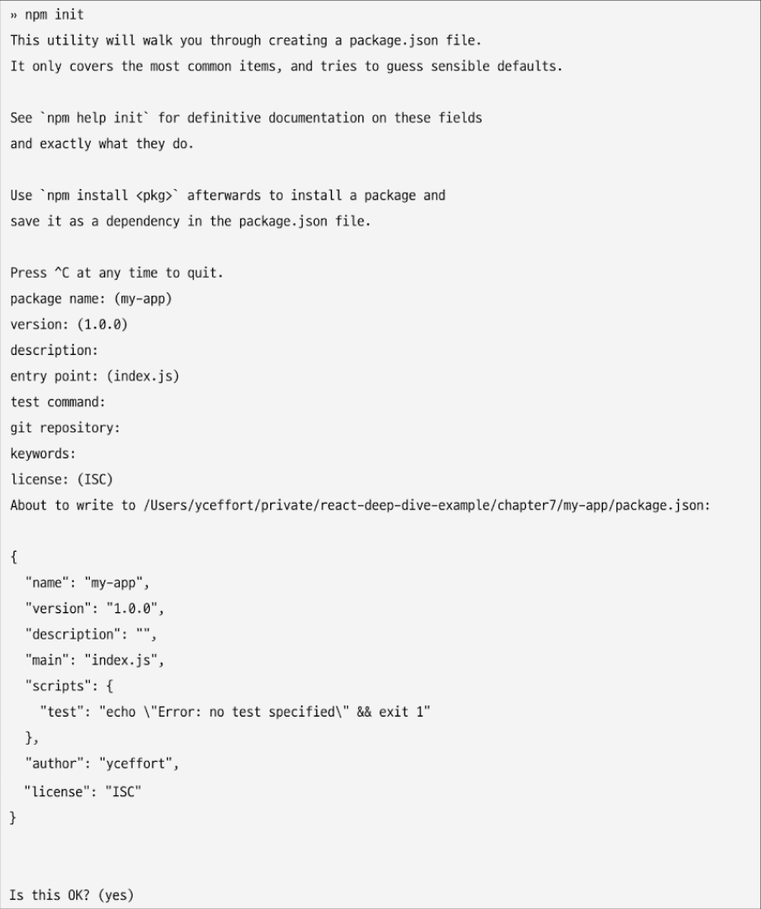

# 모던 리액트 개발 도구로 개발 및 배포 환경 구축하기

# 📑 Next.js로 리액트 개발 환경 구축하기

create-react-app과 create-next-app은 각각 리액트 애플리케이션과 Nest.js 애플리케이션을 손쉽게 만들기 위한 CLI 도구다.

프론트 엔드 개발자가 직접 만든 애플리케이션을 온전히 이해하려면 package.json부터 시작해서 하나씩 필요한 파일을 직접 설정해 봐야 한다.

❣️ cerate-react-app은 이제 더 이상 유지보수되지 않을 가능성이 크기 때문에 create-react-app의 대안 (create-next-app과 같은) 또는 아무것도 없는 상태에서 리액트 프레임워크를 구축하는 방법을 공부해 둘 필요가 있다.

## 🖌️ create-next-app 없이 하나씩 구축하기

가장 먼저 할 일은 package.json을 만드는것이다.

package.json 파일을 직접 만들 수도 있지만, npm init을 실행하면 package.json을 만드는 CLI를 실행할 수 있다.



→ 이 과정을 거치고 나면 `package.json`이 생성되어 있을 것이다.

Next.js 프로젝트를 실행하는 데 필요한 핵심 라이브러리인 `react`, `react-dom`, `next`를 설치하자.


그리고 `devDependencies`에 필요한 패키지를 설치하자. 여기서는 typescript, 타입스크립트 내부에서 리액트 타입 지원에 필요한 `@types/react`, `@types/react-dom`, 마찬가지로 Node.js의 타입을 사용하기 위한 `@types/node`, 리고 ESLint 사용에 필요한 `eslint`, `eslint-config-next`를 설치한다.


⇒ 이제 기본적인 패키지 설치는 모두 완료됐다.

⇒ `dependencies`, `devDependencies`, `peerDependencies`의 차이점은 뒤에서 알아보자.

## 🖌️ tsconfig.json 작성하기

필요한 라이브러리를 모두 설치했다면 이제 타입스크립트 코드를 작성하기 위한 준비를 해야 한다.

npm 설정을 package.json에서 하는 것처럼 타입스크립트 설정은 tscongi.json에 기록한다.

이제 tsconfig.json을 작성하는 방법을 알아보자.

```jsx
{
	"$schema": "https:.//json.schemastore.org/tsconfig.json"
}
```

→ tsconfig.json을 작성하기 전에 위와 같이 JSON 최상단에 `$schema 키와 값`을 넣어둔다.

→ $schema는 schemaStore에서 제공해 주는 정보로, 해당 JSON 파일이 무엇을 의미하는지, 또 어떤 키와 어떤 값이 들어갈 수 있는지 알려주는 도구이다.

→ $schema와 올바른 값이 선언돼 있다면 VS Code나 웹스톰(WebStorm) 같은 IDE에서 자동 완성이 가능해진다.


→ 이와 같이 VS Code에서 자동 완성의 도움을 받을 수 있다.

이 밖에도 `.eslintrc`, `.prettierrc`와 같이 JSON 방식으로 설정을 작성하는 라이브러리가 schemastore에 해당 내용을 제공하고 있다면 더욱 편리하게 JSON 설정을 작성할 수 있다.

이제 `tsconfig.json`을 완성해 보자.

```jsx
{
	"$schema": "https:.//json.schemastore.org/tsconfig.json",
	"compilerOptions": {
		"target": "es5",
		"lib": ["dom", "dom.iterable", "esnext"],
		"allowJs": true,
		"skipLibCheck": true,
		"strict": true,
		"forceConsistentCasingInFileNames": true,
		"noEmit": true,
		"esModuleInterop": true,
		"module": "esnext",
		"moduleResolution": "node",
		"resolveJsonModule": true,
		"isolatedModules": true,
		"jsx": "preserve",
		"incremental": true,
		"baseUrl": "src",
		"pathe": {
			"#pages/*": ["pages/*"],
			"#hools/*": ["hooks/*"],
			"#types/*": ["types/*"],
			"#components/*": ["components/*"],
			"#utils/*": ["utils/*"]
		}
	},
	"include": ["next-env.d.ts", "**/*.ts", "**/*.tsx"],
	"exclude": ["node_modules"]
}
```

- compilerOptions : 타입스크립트를 자바스크립트로 컴파일할 때 사용하는 옵션이다.

  - target : 타입스크립트가 변환을 목표로 하는 언어의 버전을 의미한다. 여기서는 es5로 설정돼 있기 때문에 es6의 화살표 함수는 일반 함수로 변환될 것이다. 단, 폴리필까지는 지원하지 않기 때문에 Promise와 같이 별도의 폴리필이 필요한 경우까지 도와주지는 않는다.
  - lib : lib는 target과 조금 성격이 다르다. 예를 들어, 프로젝트에서 es5 지원을 목표로 하고 있고, Promise나 Map 같은 객체들도 폴리필을 붙여서 지원할 환경을 준비했다고 가정하자. 그러나 여전히 타입스크립트는 Promise나 Map의 존재에 대해서는 모를 것이다. 이 경우에 가장 최신 버전을 의미하는 esnext를 추가하면 target은 es5라 할지라도 신규 기능에 대한 API 정보를 확인할 수 있게 되어 에러가 발생하지 않는다. 여기서는 dom도 추가됐는데, 이는 타입스크립트 환경에서 window, document 등 브라우저 위주의 API에 대한 명세를 사용할 수 있게 하기 위해서다.
  - allowJS : 타입스크립트가 자바스크립트 파일 또한 컴파일할지를 결정한다. 주로 자바스크립트 프로젝트를 타입스크립트로 전환하는 과정에서 .js와 .ts 파일이 혼재됐을 때 사용하는 옵션이다.
  - skipLibCheck : 라이브러리에서 제공하는 d.ts에 대한 검사 여부를 결정한다. d.ts는 타입스크립트에서 제공하는 타입에 대한 정보를 담고 있는 파일이다. 예를 들어, react의 경우를 생각해 보자. 기본적으로 먼저 자바스크립트 프로잭트에서 사용하기 위해서 자바스크립트 라이브러리 react가 존재할 것이다.
    그리고 타입스크립트에서 react를 사용하기 위해서, 즉 타입의 도움을 받기 위해서는 자바스크립트 파일만으로는 부족한데, 이 라이브러리의 타입 정보를 가지고 있는 것이 바로 d.ts다.
    이 옵션은 라이브러리의 d.ts를 검사하지 않는다는 것이다. 만약 이 옵션이 켜져 있다면 d.ts에 에러가 있다는 에러를 발생시킨다. 그렇지만 이 경우 라이브러리의 d.ts까지 검사해서 전체적인 프로젝트의 컴파일 시간이 길어지므로 일반적으로는 꺼놓는 경우가 많다.
  - strict : 타입스크립트 컴파일러의 엄격 모드를 제어한다. 이 모드가 켜지면 다음 옵션도 true로 설정되는 것과 같다.

    - alwaysStrict : 모든 자바스크립트 파일에 use strict를 추가한다.
    - strictNullChecks : 엄격한 널 검사(null check)를 활성화한다. 이 옵션을 켜면 null과 undefined를 명확하게 구분해 사용할 수 있게 된다. 예를 들어, 다음 코드를 살펴보자

      ```jsx
      const ids [1, 2, 3]

      const found = ids.find((id) => id === 1)
      // strictNullChecks가 true라면 found는 number | undefined 타입이 되고,
      // Object가 undefined일 수 있다.
      found + 1
      ```

      → 이 코드는 개발자가 보기에는 무조건 found가 1이기 때문에 오류가 날 수 없는 코드다. 그러나 strictNullChecks를 켜게 되면 Array.prototype.find와 같이 undefined나 null의 가능성이 있는 모든 코드에 대해 undefined, null을 반홚한다.
      → 보기에는 번거로워 보이지만 이후에 있을 수 있는 런타임 에러를 미연에 방지하는 좋은 옵션이다.

    - strictBindCallApply: 함수에 대해 사용할 수 있는 call, bind, apply에 대해 정확한 인수를 요구하는 옵션이다. 예를 들어, 다음 코드를 보자.

      ```jsx
      function add(a: number, b: number) {
        return a + b;
      }

      // strictBindCallApply가 true라면
      // 2개의 인수를 예상했지만 3개의 인수를 넘겨줬다.
      add.call(null, 1, 2, 3);
      ```

      add 함수는 2개의 인수를 받는데, call을 통해 3개의 인수를 넘겨주었기 때문에 에러가 발생한다. 이 옵션을 켜두면 call, bind, apply를 사용할 때 정확한 인수를 넘겨주지 않으면 에러가 발생한다.
      물론 위 코드는 마찬가지로 자바스크립트에서는 인수의 수가 많아질 경우 이후 인수를 무시해 크게 문제되지 않지만 향후에 발생할 수 있는 런타임 에러를 방지해 주므로 꼭 켜두기를 권장한다.

    - strictFunctionTypes: 함수의 타입에 대해 엄격함을 유지한다. 다음 코드를 보자.

      ```jsx
      function add(a: number, b: number) {
        return a + b;
      }

      type Add = (a: number | string, b: number | string) => number | string;

      // strictFunctionTypes가 true라면,
      // 타입 오류: (a: number, b: number) => number 타입은 Add에 할당할 수 없습니다.
      // ...
      let newAdd: Add = add;
      ```

      strictFunctionTypes 옵션이 켜져 있으면 add 함수의 인수가 다르다는 에러가 발생한다. 이 옵션도 마찬가지로 특별한 이유가 없다면 켜두는 것을 권장한다.

    - strictPropertyInitialization : 클래스 내부의 프로퍼티에 값을 할당할 때 타입이 올바르지 않다면 에러가 발생한다.
    - noImplicitAny : 타입을 명시하지 않은 변수가 있다면 any를 자동으로 할당하는 기능이 있다. 그러나 이 옵션을 켜두면 타입을 명시하지 않은 변수에 any를 넣지 않고 에러가 발생한다.
    - noImplicitThis : this를 추론할 수 없는 상황에서 any를 자동으로 할당하는 기능이 있다. 그러나 이 옵션을 켜두면 any를 할당하지 않고 에러가 발생한다.
    - useUnknownInCatchVariables : catch 구문에서 잡은 변수에 대해서는 기본적으로 any를 할당한다. 그러나 4.0부터는 이 옵션을 해당 변수에 unknown을 할당한다. 이는 적절한 옵션으로 보인다. 왜냐하면 try…catch 구문애서 잡히는 것이 꼭 에러라는 법은 없기 때문이다. 다음 자바스크립트 코드를 살펴보자.
      ```jsx
      try {
        throw 5;
      } catch (e) {
        // number
        console.log(typeof e);
      }
      ```
      이 옵션을 켜두는 것은 타당한 선택이라고 볼 수 있다. 대신 진짜 error를 잡고 싶다면 가드 문을 사용하면 된다.
      ```jsx
      try {
        throw new Error();
      } catch (e) {
        if (e instanceof Error) {
          // Error
          console.log(e);
        }
      }
      ```
      strict 모드는 타입을 엄격히 지키는 것을 도와주고, 나아가 타입스크립트의 타입 시스템을 이해하는 데 많은 도움을 얻을 수 있으므로 자바스크립트를 타입스크립트로 전환하는 과도기 과정과 같이 타입을 엄격하게 강제할 수 없는 상황이 아니라면 켜두는 것을 권장한다.
    - forceConsistentCasingInFileNames : 이 옵션을 켜면 파일 이름의 대소문자를 구분하도록 강제한다. 예를 들어, 이 옵션이 켜져 있으면 SignUp과 Signup은 서로 다른 파일로 간주된다.
    - noEmit : 컴파일을 하지 않고, 타입 체크만 한다. 타입스크립트를 사용함에도 이 옵션을 켜두는 것이 의아할 수 있는데, Nest.js는 swc가 타입스크립트 파일을 컴파일하므로 굳이 타입스크립트가 자바스크립트로 컴파일할 필요가 없다. 이 옵션이 켜져 있으면 타입스크립트는 단순히 타입 검사만 하는 역할을 한다. 참고로 swc는 러스트 기반 컴파일러로, 타입 스크립트 대비 월등히 빠른 컴파일 속도를 자랑한다. swc에 대한 설명은 4장 Nest.js 톺아보기를 확인해보자.
    - esModuleInterop : CommonJS 방식으로 보낸 모듈을 ES 모듈 방식의 import로 가져올 수 있게 해준다. 과거 자바스크립트에는 여러 가지 방식의 모듈 옵션이 존재했는데 대표적인 것이 CommonJS와 AMD 방식이다. 현재는 `export function …` 스타일의 ES 모듈 방식이 대세로 자리 잡았지만 Node.js만 하더라도 module.exports의 CommonJS 방식으로 export돼 있는 것을 볼 수 있다. 이 옵션을 켜두면 CommonJS 방식으로 내보낸 모듈도 ES 방식으로 import할 수 있게끔 도와준다.
    - module : 모듈 시스템을 설정한다. 대표적으로 commonjs와 export가 있따. commonjs는 require를 사용하고, esnext는 import를 사용한다. esnext는 import를 사용하므로 import를 사용할 수 있는 환경에서는 esnext를 사용하는 것이 좋다.
    - moduleResolution : 모듈을 해석하는 방식을 설정한다. node는 node_modules를 기준으로 모듈을 해석하고, classic은 tsconfig.json이 있는 디렉터리를 기주으로 모듈을 해석한다. node는 module이 CommonJS일 때만 사용할 수 있다.
    - resolveJsonModule : JSON 파일을 import할 수 있게 해준다. 이 옵션을 켜두면 allowJs 옵션도 자동으로 켜진다.
    - isolatedModules : 타입스크립트 컴파일러는 파일에 import나 export가 없다면 단순 스크립트 파일로 인식해 이러한 파일이 생성되지 않도록 막는다. 즉, 단순히 다른 모듈 시스템과 연계되지 않고 단독으로 있는 파일의 생성을 막기 위한 옵션이라 볼 수 있다.
    - jsx : .tsx 파일 내부에 있는 JSX를 어떻게 컴파일할지 설정한다. 옵션별로 다음과 같이 파일이 변환된다.
      ```jsx
      export const Hello = () => <div>Hello</div>;
      ```
      - react : 기본값이며 React.createElement로 변환된다. 리액트 16까지 기본적인 변환 방식이다.
        ```jsx
        export const Hello = () => React.createElement("h1", null, "Hello");
        ```
      - react-jsx : 리액트 17에서 새롭게 등장한 방식으로, react/jsx-runtime을 사용해 변환한다. 이 방식을 사용하면 React.createElement를 사용하지 않아 import React from ‘react’를 컴포넌트 상단에 적지 않아도 된다.
        ```jsx
        import { jsx as _jsx } from "react/jsx-runtime";
        export const Hello = () => _jsx("div", { children: "Hello" });
        ```
      - react-jsxdev : react-jsx와 동일하지만 디버깅 정보가 추가된다.
        ```jsx
        import { jsxDEV as _jsxDEV } from "react/jsx-dev-runtime";
        const _jsxFileName = "file:///input.tsx";
        export const Hello = () =>
          _jsxDEV(
            "div",
            { children: "Hello" },
            void 0,
            false,
            { fileName: _jsxFileName, lineNumber: 1, columnNumber: 27 },
            this
          );
        ```
      - preserve : 변환하지 않고 그대로 유지한다.
        ```jsx
        export const Hello = () => <div>Hello</div>;
        ```
      - react-native : 리액트 네이티브에서 사용하는 방식으로, 마찬가지로 변환하지 않는다.
        ```jsx
        export const Hello = () => <div>Hello</div>;
        ```
        프로젝트의 리액트 버전에 따라 react-jsx 또는 react를 적절하게 사용하면 된다. 여기서는 preserve가 사용됐는데, swc가 JSX 또한 변환해 주기 때문이다.
      - incremental : 이 옵션이 활성화되면 타입스크립트는 마지막 컴파일 정보를 .tsbuildinfo 파일 형대로 만들어 디스크에 저장한다. 이렇게 컴파일 정보를 별도 파일로 저장해 두면 이후에 다시 컴파일러가 호출됐을 때 해당 정보를 활용해 가장 비용이 적게 드는 방식으로 컴파일을 수행해 컴파일이 더 빨라지는 효과를 누릴 수 있다.
      - baseUrl : 모듈을 찾을 때 기준이 되는 디렉터리를 저장한다. 이 설정은 바로 밑에서 소개할 paths와 함께 사용된다.
      - paths : 일반적으로 모듈을 불러오게 되면 ./나 ../를 활용한 상대 경로를 활용하게 된다. 그러나 이 상대 경로는 파일이 많아지고 구조가 복잡해질수록 ../../ 등이 중첩되면서 읽기 어려워지는데, paths를 활용하면 이러한 경로에 별칭(alias)을 지정할 수 있다. 예를 들어, #hooks의 경우 #hooks/useToggle이라는 경로가 존재하면 이는 baseUrl과 함께 src/hooks/useToggle이라는 경로로 해석된다. 이렇게 별칭을 지정하면 경로가 길어지는 것을 방지하고 경로를 읽기가 더욱 쉬워진다. 이 별칭은 보통 #나 $ 같은 특수문자 접두사화 함께 자주 사용된다. 단 @의 사용은 자체하는 것이 좋다. 왜냐하면 @는 보통 @angular, @types와 같이 스코프 패키지에 널리 사용되기 때문이다. @는 네이밍에 따라 충돌할 여지가 있으므로 가급적 사용을 피한다.

  - include : 타입스크립트 컴파일 대상에서 포함시킬 파일 목록을 의미한다. 여기서는 타입스크립트 파일과 Next.js에서 자동으로 생성하는 next-env.d.ts 파일을 포함시켰다.
  - exclude : 타입스크립트 컴파일 대상에서 제외시킬 파일 목록을 의미한다. node_modules를 대상에서 제외시켰다.

  ## 🖌️ next.config.js 작성하기

  next.config.js는 Next.js 설정을 위한 파일이다.

  ```jsx
  /** @type {import{'next').NextConfig} */
  const nextConfig = {
    reactStrictMode: true,
    poweredByHeader: false,
    eslint: {
      ignoreDuringBuilds: true,
    },
  };

  module.exports = nextConfig;
  ```

  → next.config.js가 제공하는 설정 파일은 버전별로 조금씩 다르기 때문에 깃허브 저장소에서 확인해볼 수 있다. https://github.com/vercel/next.js/blob/v12.3.1/packages/next/server/config-shared.ts

위에서 활성화한 옵션을 알아보자.

- `reactStrictMode` : 리액트의 엄격 모드를 활성화한다.
- `poweredByHeader` : 일반적으로 보안 취약점으로 취급되는 X-Powered-By 헤더를 제거한다.
- `eslint.ignoreDuringBuilds` : 빌드 시에 ESLint를 무시한다. 일반적으로 Next.js 빌드 시에 ESLint도 같이 수행하는데 여기서는 true로 설정해 빌드 시에 ESLint를 수행하지 않게 했다. 이후에 ESLint는 CI 과정에서 별도로 작동하게 만들어 빌드를 더욱 빠르게 만들 것이다.

## 🖌️ ESLint와 Prettier 설정하기

아래는 ESLint 관련 설정이다.

eslint와 eslint-config-next만 설치하기엔 부족하니 더 알아보자.

eslint-config-next는 단순히 코드에 있을 잠재적인 문제를 확인할 뿐, 띄어쓰기나 줄바꿈과 같이 코드의 스타일링을 정의해 주지는 않는다. 코드 스타일링 등 eslint-config-next가 해주지 않는 일반적인 ESLint 작업을 수행하기 위해 가장 설치 및 설정이 쉬운 `@titicaca/eslint-config-triple`을 설치해 사용한다.


`eslint-config-next`와 `eslint-config-triple`이 함께 작동하려면 다음과 같은 별도 설정이 필요하다.

```jsx
const path = require("path");

const createConfig = require("@titicaca/eslint-config-triple/create-config");

const { extends: extendConfigs, overrides } = createConfig({
  type: "frontend",
  project: path.resolve(__dirname, "./tsconfig.json"),
});

module.exports = {
  extends: [...extendConfigs, "next/core-web-vitals"],
  overrides,
};
```

→ extends에 `next/core-web-vitals`를 추가하면 두 가지 설정이 모두 적용된다. 이 외에도 `.eslintignore`나 `.prettierignore`에 .next나 node_modules를 추가해 정적 분석 대상에서 제외시킨다.

## 🖌️ 스타일 설정하기

SCSS를 사용하는 등 여러 가지 방법이 있지만 `styled-components`를 사용하는 방법에 대해 알아보자.

우선 `styled-components`를 설치한다.


그리고 swc에 styled-components를 사용한다는 것을 알리기 위해 styledComponents: true를 next.config.js에 추가한다.

→ 이렇게 하면 swc가 styled-components를 사용하는 코드를 더 빠르게 변환한다.

추가적으로 pages/\_document.tsx에 Head에 styled-components를 사용하기 위한 ServerStyleSheet를 추가한다. (4장 Next.js 톺아보기 참고)

```jsx
import Document, {
  Html,
  Head,
  Main,
  NextScript,
  DocumentContext,
  DocumentInitialProps,
} from "next/document";
import { ServerStyleSheet } from "styled-components";

export default function MyDocument() {
  return (
    <Html lang="ko">
      <Head />
      <body>
        <Main />
        <NextScript />
      </body>
    </Html>
  );
}

MyDocument.getInitialProps = async (
  ctx: DocumentContext
): Promise<DocumentInitialProps> => {
  const sheet = new ServerStyleSheet();
  const originalRenderPage = ctx.renderPage;

  try {
    ctx.renderPage = () =>
      originalRenderPage({
        enhancApp: (App) => (props) => sheet.collectStyles(<App {...props} />),
      });

    const initialProps = await Document.getInitialProps(ctx);
    return {
      ...initialProps,
      styles: (
        <>
          {initialProps.styles}
          {sheet.getStyleElement()}
        </>
      ),
    };
  } finally {
    sheet.seal();
  }
};
```

## 🖌️ 애플리케이션 코드 작성

Next.js 프로젝트 기본적인 폴더 구조는 다음과 같다.


애플리케이션 구동에 필요한 파일은 src 폴더 내부에 있으며, 하위 폴더 목록은 다음과 같다.

- `pages` : Next.js에서 예약어로 지정해 두고 사용하는 폴더로, 이 폴더 하위의 내용은 모두 실제 라우터가 된다.
  - `/`: 메인 페이지
  - `/todos/:id` : 상세 페이지
- `components` : 페이지 내부에서 사용하는 컴포넌트를 모아둔 폴더
- `hooks` : 직접 만든 훅을 모아둔 폴더
- `types` : 서버 응답 타입 등 공통으로 사용하는 타입을 모아둔 폴더
- `utils` : 애플리케이션 전역에서 공용으로 사용하는 유틸성 파일을 모아둔 폴더

→ Next.js 애플리케이션의 폴더 구조는 src/pages 하단에 실제 페이지 라우팅과 관련된 파일을 기재해야 한다는 컨벤션만 지키면 된다.

→ 폴더 구조에는 정답이 없다.

→ 모든 폴더에 tsconfig.json을 활용해 적절한 경로 별칭(path alias)을 적용한다면 코드 내에서의 가독성 또한 확보할 수 있을 것이다.

Next.js 프로젝트 실행, 빌드, 린트와 관련된 명령어를 package.json에 추가한다.

```jsx
{
	"//": "생략",
	"scripts": {
		"dev": "next dev",
		"start": "next start",
		"build": "next build",
		"lint:es": "eslint '**/*.{js,ts,tsx}'",
		"lint:es:fix": "npm run lint:es -- -- fix",
		"prettier": "prettier '**/*' --check",
		"prettier:fix": "prettier '**/*' --write"
	},
	"//": "생략"
}
```

실무에서 사용할 프로젝트나 개인 프로젝트에서 사용할 프로젝트를 만들다보면 똑같은 설정을 매번 반복하는 것은 비효율적이라고 생각할 수 있을 것이다.

그래서 아래의 방법을 활용해보자.

1. 먼저 보일러플레이트 프로젝트를 만든 다음, 깃허브에서 “Template repository” 옵션을 체크해두는 것이다.

   

   → 이렇게 저장소를 템플릿 저장소로 만들어두면 다른 저장소를 생성할 때 이 내용을 모두 복사해서 생성할 수 있다.

   

   이렇게 위에서 만든 템플릿으로 만든 저장소를 선택한다.

   그리고 아래 사진과 같이 템플릿으로 저장소를 생성하면 다음과 같이 저장소명과 함께 ‘generated from’이라는 메시지로 어떤 템플릿에서 만들어진 저장소인지 확인할 수 있다.

   

1. create-next-app에서 한 발 더 나아가 나만의 create-\*\*\*-app을 만드는 것이다. 앞서 방법은 내용을 그대로 가져오는 수준이지만 cli 패키지로 만든다면 create-next-app과 마찬가지로 사용자의 입력을 받아 서로 다른 패키지를 만들 수 있다.

   이 방법은 위의 방법보다 훨씬 손이 더 많이 가지만 조직 내에서 마이크로서비스를 지향하고 있고, 앞으로 생성해야 할 프로젝트 또한 많다면 사용해볼만한 방법이다.

   다음 두 사이트를 참고해 create-\*\*\*-app을 직접 구현해보자.

   - create-next-app 내부의 코드 : create-next-app의 소스코드를 살펴보면 알겠지만 일단 하나의 템플릿을 미리 만들어 둔 다음, 여기에서 CLI로 사용자의 입력을 받아 커스터마이징한 것을 알 수 있다.
     - https://github.com/vercel/next.js/blob/canary/packages/create-next-app/index.ts
   - Createing a CLI tool with Node.js : npm을 기반으로 CLI 패키지를 만드는 방법을 상세하게 설명하고 있다.
     - https://blog.logrocket.com/creating-a-cli-tool-with-node-js/

# 📑 깃허브 100% 활용하기

깃허브는 무료 Git 저장소 서비스를 시작으로 패키지를 저장할 수 있는 이미지 레지스트리 서비스인 GitHub Packages, 지라(Jira)와 같이 프로젝트를 관리할 수 있게 도와주는 GitHub Projects, 간단한 웹사이트를 운영할 수 있는 GitHub Pages, 그리고 최근 공개해 개발자들에게 많은 화제가 된 인공지능 코딩 어시스턴스 서비스인 GitHub Codespaces까지 다양한 서비스를 제공한다.

코드 저장소의 역할을 기반으로 CI/CD와 같은 자동화, 보안 이슈 점검, 프로젝트 관리 등 일반적인 웹서비스 관리 및 운영에 필요한 많은 일을 할 수 있으며, 이 다양한 기능을 개인 사용자의 경우 거의 무료로 사용할 수 있따.

## 🖌️ 깃허브 액션으로 CI 환경 구축하기

`깃허브 액션(GitHub Actions)`에 대해 본격적으로 알아보기에 앞서 먼저 `CI(Contitionus Integration)`에 대해 알아보자.

소프트웨어를 구성하는 핵심 요소인 코드인 여러 개발자들이 계속해서 코드에 기여함으로써 계속해서 진화하고 발전한다. 이러한 코드의 변화를 모으고 관리하는 코드 중앙 저장소에서, 여러 기여자가 기여한 코드를 지속적으로 빌드하고 테스트해 코드의 정합성을 확인하는 과정을 바로 `CI`라고 한다.

- CI의 핵심은 저장소에서 코드의 변화가 있을 때마다 전체 소프트웨어의 정합성을 확인하기 위한 작업을 자동으로 실행해야 한다는 것이다. 여기서 자동으로 실행해야 하는 작업이랑 테스트, 빌드, 정적 분석, 보안 취약점 분석 등이 있다.

과거 이 CI 환경을 구축하기 위해 가장 자주 쓰인 솔루션은 바로 젠킨스(Jenkins)다.

- 젠킨스는 CI에 필요한 다양한 기능을 제공하는 무료 솔루션이었지만 사용하는 데 번거로움이 많았다.
  → 젠킨스는 기본적으로 설치형 솔루션이기 때문에 별도 서버를 구축해야 하고, 서버 내에서 젠킨스를 설치해야 하고, 또 젠킨스를 사용 중인 저장소와 연결하는 작업을 해야만 했다.
  → 젠킨스 자체는 편리하고 많은 플러그인을 통해 다양한 기능을 통합할 수 있었지만 설치 및 유지보수가 번거롭다는 단점이 있다.
- 젠킨스의 대안으로 떠오르는 것이 깃허브 액션이다.

깃허브 액션은 깃허브에서 출시한 SaaS로, 깃허브 저장소와 함께 사용할 수 있는 강력한 도구다.

즉, 깃허브 액션은 젠킨스 같은 CI 솔루션을 대체하기 위해 만들어진 도구는 아니다.

깃허브 액션의 본래 목적은 깃허브 저장소를 기반으로 깃 허브에서 발생하는 다양한 이벤트를 트리거 삼아 다양한 작업을 할 수 있게 도와주는 것이다. 이러한 작업에는 다음과 같은 것이 포함된다.

- 깃허브의 어떤 브랜치에 푸시가 발생하면 빌드를 수행한다.
- 깃허브의 특정 브랜치가 메인 브랜치를 대상으로 풀 리퀘스트가 열리면 빌드, 테스트, 정적 분석을 수행한다.

즉, 깃허브를 둘러싼 다양한 이벤트를 기반으로 깃허브에서 제공하는 가상 환경에서 사용자가 원하는 작업을 수행할 수 있도록 도와주는 서비스다. 그리고 이러한 특징을 활용하면 다른 `CI/CD(Continuous Integration/Continuous Delivery)` 솔루션을 대체할 수 있다는 것이 널리 알려지게 되면서 깃허브 액션이 CI/CD 서비스로서 주목받게 되었다.

하지만 깃허브 액션이 젠킨스와 같이 유서 깊고 오래된 CI 도구를 즉시 대체할 수 있는 수단이라고까지 보기는 어렵다.

→ 그 이유는 젠킨스는 구축에 어려움이 있지만 한번 잘 구축한 젠킨스 CI 파이프라인으로는 단순히 한 저장소의 코드에 그치지 않고 많은 것들을 수행할 수 있으며, 자체 서버를 구축할 수 있다는 장점 덕분에 제한적인 환경에서도 구축할 수 있다.

→ 그럼에도 불구하고 깃허브 액션은 깃허브 저장소를 기반으로 CI를 구축하고자 할 때 매우 유용하게 사용할 수 있다.

프론트엔드 애플리케이션을 예로 들어보자.

프론트엔드 애플리케이션은 일부 서버 응답과의 연동을 하는 시나리오를 제외한다면 저장소에 있는 코드만으로 테스트, 빌드, 정적 분석 등 CI에 필요한 대부분의 기능을 손쉽게 구현할 수 있다.

→ 하나의 저장소에서 빠르고 다양한 CI 환경을 구축하고자 하는 상황에서는 깃허브 액션이 훨씬 경제적이다.

### 깃허브 액션의 기본 개념

우선 깃허브 액션에서 자주 언급되는 개념을 알아보자.

- `러너(runner)` : 러너란 파일로 작성된 깃허브 액션이 실행되는 서버를 의미한다. 특별히 지정하지 않으면 공용 깃허브 액션 서버를 이용하며, 별도의 러너를 구축해 자체적으로 운영할 수도 있다.
- `액션(action)` : 러너에서 실행되는 하나의 작업 단위를 의미한다. yaml 파일로 작성된 내용을 하나의 액션으로 볼 수 있다.
  - `pull_request` : PR(pull request)과 관련된 이벤트로서, PR이 열리거나, 닫히거나, 수정되거나, 할당되거나, 리뷰 요청되는 등의 PR과 관련된 이벤트를 의미한다.
  - `issues` : 이슈와 관련된 이벤트로서 이슈가 열리거나, 닫히거나, 삭제되거나, 할당되는 등 이슈와 관련된 이벤트를 의미한다.
  - `push` : 커밋이나 태그나 푸시될 때 발생하는 이벤트를 의미한다.
  - `schedule` : 저장소에서 발생하는 이벤트와 별개로 특정 시간에 실행되는 이벤트를 의미한다. 여기서 말하는 시간은 cron에서 사용되는 시간을 의미한다.
    cron이란 유닉스 계열 운영체제에서 실행되는 시간 기반 잡 스케줄러로, 여기서는 특정 시간을 표현할 때 다음과 같은 형식을 취한다.
    - `5 4 * * *` : 매일 4시 5분에 실행, 분, 시간, 일, 월, 요일 순으로 표현하며, \*는 모든 값을 의미한다. 본인이 원하는 시간대를 표현해 보고 싶다면 crontab guru(https://crontab.guru/)에서 확인해보자.
  - `잡(jobs)` : 잡이란 하나의 러너에서 실행되는 여러 스텝의 모음을 의미한다. 하나의 액션에서 여러 잡을 생성할 수 있으며, 특별히 선언한게 없다면 내부 가상머신에서 각 잡은 병렬로 실행된다.
  - `스텝(steps)` : 잡 내부에서 일어나는 하나하나의 작업을 의미한다. 셀 명령어나 다른 액션을 실행할 수도 있다. 이 작업은 병렬로 일어나지 않는다.

→ 요약하자면 스텝들을 엮어서 잡을 만들고, 이러한 여러 개의 잡은 병렬로 실행되며, 이러한 잡을 하나 이상 모아둔 것을 액션이라고 한다. 그리고 이 액션을 실행하는 것이 러너다.

### 깃허브 액션 작성하기

액션을 작성하려면 저장소의 루트에 .github/workflow 폴더를 생성하고 내부에 파일을 작성하면 된다.

파일명은 마음대로 지정할 수 있으며, yaml 파일 작성을 위해 확장자는.yml 또는 .yaml로 지정해야 한다.

아래 예시 파일을 살펴보자.

```jsx
name: chapter7 build
run-name: ${{ github. actor }} has been added new commit.

on:
	push:
		branches-ignore:
			- 'main'

jobs:
	build:
		runs-on: ubuntu-latest
		steps:
			- uses: actions/checkout@v3
			- uses: actions/setup-node@v3
				with:
					node-version: 16
			- name: 'install dependencies'
				working-directory: ./chapter7/my-app
				run: npm ci
			- name: 'build'
				working-directory: ./chapter7/my-app
				run: npm run build
```

→ 저장소에 Prettier가 설치돼 있다면 yaml 파일도 함께 포함시켜 코드 스타일을 유지하는 것이 좋다.

→ 이 예제는 Next.js 애플리케이션의 빌드를 확인하는 CI 액션이다. 해당 파일을 `./github/workflows/build.yaml`이라는 이름으로 저장한 다음, 별도 브랜치에서 푸시하고 풀 리퀘스트를 만들어 확인해보자.


→ 깃허브 액션의 결과를 풀 리퀘스트에서 확인할 수 있다.

그리고 Details를 누르면 해당 CI가 어떤 절차를 거쳐서 완료됐는지 확인할 수 있다.


Details에서는 해당 액션의 실행 결과를 자세히 확인할 수 있다. 아래 사진처럼 해당 로그는 시간이 지나면 사라지므로 일정 시간 이후에도 보려면 별도의 조치가 필요하다.


액션의 실행 결과를 살펴봤으니 구체적으로 액션이 yaml 파일 내에서 어떻게 작성됐고 각 값의 뜻은 무엇인지 알아보자.

**name**

name은 액션의 이름이다. 필수 값은 아니지만, 액션을 구별하는 데 도움이 되므로 이름을 지정하는 것이 좋다.

**run-name**

run-name은 액션이 실행될 때 구별할 수 있는 타이틀명이다. 이 또한 필수 값은 아니다. 다만 예제와 같이 github.actor를 활용해 어떤 사람이 해당 액션을 트리거했는지 정도를 구별하는 데 쓸 수 있다. 만약 설정돼 있지 않다면 풀 리퀘스트 이름이나 마지막 커밋 메시지 등이 출력된다.

**on**

on은 필수 값으로, 언제 이 액션을 실행할지를 정의한다. 이 예제에서는 원격 저장소의 푸시가 발생했을 때 실행하도록 했으며, main 브랜치에 푸시가 발생했을 때는 실행하지 않도록 설정했다.

→ main 브랜치의 직접적인 푸시는 풀 리퀘스트가 머지됐을 때만 일어나며, 이 풀 리퀘스트 머지 단계에서 이미 해당 액션으로 CI를 통과햇을 것이기 때문이다.

main 브랜치를 제외하지 않는다면 CI 중복 실행이 발생하기 때문에 별도로 막아뒀다.

이 밖에도 다양한 옵션을 확인할 수 있는데, 자세한 옵션은 깃허브 문서를 참고하자.

https://docs.github.com/en/actions/using-workflows/workflow-syntax-for-github-actions#on

**jobs**

jobs는 필수 값으로, 해당 액션에서 수행할 잡을 의미한다. 한 개 이상 설정할 수 있으며, 여러 개를 지정하면 병렬로 실행된다.

- jobs.bulid : build는 GitHub Actions의 예약어가 아니다. 임의로 지정한 이름으로, name과 같은 역할을 한다고 보면 된다. jobs의 하위 항목이므로 반드시 들여쓰기해야 한다. 이 파일에서는 jobs에 1개 이상의 작업이 있는데, 그중 하나의 작업이 build라는 것을 의미한다.
- jobs.build.runs-on : 어느 환경에서 해당 작업이 실행될지를 결정한다. 별도의 러너를 설정하고 싶지 않고, 깃허브에서 제공하는 서버를 쓰고 싶다면 ubuntu-latest를 선언하면 된다. 만약 커스텀 러너를 쓴다면 해당 러너명을 지정하면 된다. 커스텀 러너를 쓰고 싶다면 저장소의 Settings → Actions → Runners에서 추가할 수 있다. 그 외에도 사용 가능한 환경은 깃허브 문서를 참고한다.
  https://docs.github.com/en/actions/using-workflows/workflow-syntax-for-github-actions#jobsjob_idruns-on
- jobs.build.steps : 이제 해당 잡에서 순차적으로 수행할 작업을 정의한다.
  - `uses : actions/checkout@v3` : 해당 스텝에서 작업을 actions/checkout@v3을 사용해서 작업하겠다는 것을 의미한다. actions/checkout@v3은 깃허브에서 제공하는 기본 액션으로, 별도 파라미터를 제공하지 않으면 해당 브랜치의 마지막 커밋을 기준으로 체크아웃한다. 최신 코드를 기준으로 작동해야 하는 CI 액션에서는 필수적으로 사용된다.
    [https://github.com/actions/checkout](https://github.com/actions/checkout)
  - uses: actions/setup-node@v3 : 해당 스텝에서 작업을 actions/setup-node@v3를 사용해서 작업하겠다는 것을 의미한다. actions/setup-node@v3 역시 깃허브에서 제공하는 기본 액션으로, 해당 러너에 Node.js를 설치한다. with node-version.16을 함께 지정했는데, 이름에서 유추할 수 있는 것처럼 Node.js 16 최신 버전을 설치한다.
    2022년 10월을 기준으로 LTS 버전인 14, 16, 18을 설치할 수 있으니 해당 프론트엔드 프로젝트가 배포되는 Node.js 버전에 맞춰 작성하면 된다.
    [https://github.com/actions/setup-node](https://github.com/actions/setup-node)
  - `name : ‘install dependencies’` : 해당 스텝의 명칭을 지정했다. 여기서는 의존성을 설치하는 작업을 수행한다. working-directory는 터미널의 cd 명령과 비슷한 역할을 하는데, 뒤이어 수행할 작업을 해당 디렉터리에서 수행하겠다는 뜻이다. 만약 그냥 루트에서 실행해도 된다면 따로 지정하지 않아도 된다. 그리고 run을 통해 수행할 작업을 명시했다. 여기서는 의존성을 설치하기 위해 npm ci를 선언했다.
  - `name: ‘build’` : CI를 위한 작업, git checkout, Node.js 설치, 의존성 설치까지 마무리했으니 마지막 작업으로 빌드를 수행한다. npm run build를 실행해 Next.js 프로젝트를 빌드했다.

**액션 작성**

앞의 예제와 같이 액션을 작성하면 Next.js 프로젝트를 빌드하는 CI를 작성할 수 있다.

추가적으로 push마다 빌드가 발생하면 액션이 굉장히 많이 실행되기 때문에 트리거를 조정할 필요도 있고, npm이 아닌 Yarn이나 pnpm을 쓴다면 별도로 pnpm/action-setup이나 borales/actions-yarn을 사용해 설치를 해야할 수도 있다.

장점

- 젠킨스를 처음부터 구축해서 사용하는 것보다는 훨씬 손쉽게 CI를 구축할 수 있다.
- 별도의 서버를 구축하고 젠킨스를 설치할 필요도 없이 저장소에 yaml 파일을 하나를 추가하는 것만으로 CI를 구축할 수 있어 매우 용이하다.
- GitHub Actions를 적절히 활용하면 다양한 작업도 가능하다.
  - 기본적인 빌드 CI
  - actions/github-script를 사용해 깃허브 API를 직접 호출해 깃허브 풀 리퀘스트에 댓글을 달기
  - 일정 시간마다 특정한 작업을 수행
  - 배포 서비스와 연동해 자동으로 배포를 실행
  - 저장소 내부에 이미지가 추가될 때마다 이미지를 최적화

→ GitHub Actions의 다양항 기능을 알아보기에 앞의 프로젝트에 최소한 하나 이상의 액션을 작성해 프로젝트에 필요한 자동화 처리, 빌드 확인, Prettier, ESLint, 테스트 등을 자동화해 보자.

**브랜치 보호 규칙**

마지막으로 머지하기 전에 꼭 성공해야 하는 액션이 있다면 별도로 저장소에 브랜치 보호 규칙(branch protection rule)을 추가할 수 있다.

해당 저장소의 **Settings → Code and automation → Branches**로 이동한 다음, **Add branch protection rule**을 클릭해 브랜치 보호 규칙을 추가해보자.

아래의 예를 확인해보자.

- 기본 브랜치인 main 브랜치에 대해 ‘Require status checks to pass before merging(머지하기 전에 상태 체크를 필수로 한다)’과 ‘Require branches to be up date before merging(머지하기 전에 브랜치가 최신 내용인지 확인한다)’을 체크해 해당 브랜치가 최신 상태인지 확인하고 머지할 수 있는 기능을 켠다.
- 그리고 마지막으로 꼭 실행돼야 하는 액션의 파일명을 선택하고 저장하면, 해당 액션이 성공하기 전까지는 main 브랜치에 대한 머지를 막을 수 있다.
- 즉, 기본 브랜치에는 항상 테스트, 빌드와 같은 CI가 성공한 코드만 푸시될 수 있어 코드의 정합성을 확보할 수 있다.


→ main 브랜치에 머지할 때는 build.yaml이 성공해야 머지할 수 있도록 설정했다.


→ 브랜치 보호 규칙을 설정해 두면 build에 실패했을 때 머지할 수 없다. 추가로 설정에서 ‘Do not allow bypassing the above settings’를 활성화하면 관리자조차 강제로 머지할 수 없게 무조건 해당 액션이 성공해야만 머지할 수 있게 된다.

## 🖌️ 직접 작성하지 않고 유용한 액션과 깃허브 앱 가져다 쓰기

깃허브에서 Marketplaces라는 서비스를 제공해 여러 사용자가 만들어 놓은 액션을 손쉽게 가져다 쓸 수 있도록 운영하고 있다.

이곳에 공개된 액션을 적절히 활용하면 앞선 actions/checkout 예시처럼 복잡한 작업을 수행하는 액션을 손쉽게 가져다 사용할 수 있다.

깃허브에서 공식으로 제공하는 액션 외에는 향후 유지보수가 어떤식으로 이뤄질지 알 수 없기 때문에 액션을 사용하기 전에 해당 액션을 만든 저장소를 방문해 현재 상황을 파악하고 사용하는것을 권장한다.

### 깃허브에서 제공하는 기본 액션

다음은 깃허브에서 제공하는 기본 액션이다. → 다른 액션을 만들 때 쓰이는 주요 액션이다.

- `actions/checkout` : 깃허브 저장소를 체크아웃하는 액션이다. 저장소를 기반으로 작업을 해야 한다면 반드시 필요하다. 일반적으로는 아무런 옵션 없이 사용해 해당 액션을 트리거한 최신 커밋을 불러오지만 ref를 지정해 특정 브랜치나 커밋을 체크아웃할 수도 있다.
- `actions/setup-node` : Node.js를 설치하는 액션이다. Node.js를 사용하는 프로젝트라면 반드시 필요하다. 설치할 Node.js 버전을 지정할 수도 있다.
- `actions/github-script` : GitHub API가 제공하는 기능을 사용할 수 있도록 도와주는 액션이다. GitHub API를 이용하면 깃허브에서 할 수 있는 대부분의 작업을 수행할 수 있으므로 한 번쯤 API 문서를 보는것을 추천한다.
  [https://github.com/actions/github-script](https://github.com/actions/github-script)
  https://octokit.github.io/rest.js/v19
- `actions/stale` : 오래된 이슈나 PR을 자동으로 닫거나 더 이상 커뮤니케이션하지 못하도록 닫는다. 저장소가 오래되어 과거에 생성된 이슈나 풀 리퀘스트가 너무 많을 경우 정리하는 데 도움이 된다.
  [https://github.com/actions/stale](https://github.com/actions/stale)
- `actions/dependency-review-action` : 의존성 그래프에 대한 변경, 즉 package.json, package-lock.json, pmp-lock.yaml 등의 내용이 변경됐을 때 실행되는 액션으로, 의존성을 분석해 보안 또는 라이선스에 문제가 있다면 이를 알려준다.
  [https://github.com/actions/dependency-review-action](https://github.com/actions/dependency-review-action)
- `github/codeql-action` : 깃허브의 코드 분석 솔루션인 code-ql을 활용해 저장소 내 코드의 취약점을 분석해 준다. languages에 javascript만 설정해 두면 자바스크립트와 타입스크립트를 모두 검사하므로 특정 스케줄에 맞춰서 실행하거나 CI로 활용할 수 있다.
  [https://github.com/github/codeql-action](https://github.com/github/codeql-action)
  https://github.com/github/codeql-action/issues/365#issuecomment-762138640

### calibreapp/image-actions

프론트엔드 프로젝트를 진행하다 보면 이미지를 추가해서 관리하는 경우도 종종 있다. 잘 구축된 프로젝트의 경우 별도의 CDN을 사용해 이미지를 제공하기도 하지만 매우 중요한 이미지거나 혹은 아직 CDN을 구축하지 못한 경우 등은 이미지를 저장소 내부에 두고 함께 관리하곤 한다.

이러한 이미지들은 사용자에게 불편함을 주지 않는 선에서 가장 작은 파일로 관리될 필요가 있는데, 이 이미지를 압축해 관리하는 게 여간 귀찮은 일이 아니다.

→ 이를 위해 저장소에 포함돼 있는 이미지를 최적화하는 액션이 있는데, 바로 `calibreapp/image-actions`다.

이 액션은 PR로 올라온 이미지(jpg, jpeg, png 등)를 sharp 패키지를 이용해 거의 무손실로 압축해서 다시 커밋해 준다.

Next.js 같은 경우에는 이미 next/image로 이미지를 최적화하는 방법을 제공하고 있지만 저장소 자체의 이미지 크기를 줄인다면 풀(pull)할 때 부담 또한 덜 수 있어 유용하다.

https://nextjs.org/docs/pages/api-reference/components/image

https://fe-developers.kakaoent.com/2022/220714-next-image/

이미지 최적화가 필요한 곳에 다음과 같은 내용의 액션을 작성해 보자. 👇

```yaml
name: Optimize images
on: pull_request
jobs:
	build:
		name: calibreapp/image-actions
		runs-on: ubuntu-latest
		steps:
			- name: Checkout Repo
				uses: actions/checkout@v2

			- name: Compress Images
				uses: calibreapp/image-actions@main
				with:
					githubToken: ${{ secrets.GITHUB_TOKEN }}
					ignorePaths: 'LCPSample.jpeg'
```

→ 저장소에 풀 리퀘스트가 생성되면 마찬가지로 저장소를 checkout해서 calibreapp/image-actions라는 액션을 실행한다. 그리고 이 액션은 이미지를 가져다가 새롭게 커밋해야 하므로 액션이 커밋을 할 수 있도록 권한을 줘야 한다.

→ 이 권한을 제공하려면 githubToken: ${{ secrets.GITHUB_TOKEN }을 추가하면 된다.

→ 그리고 ignorePaths에 파일을 기재하면 해당 파일에 대해서는 압축을 건너뛸 수도 있다.

다음과 같이 액션을 생성하고, 이미지가 포함된 PR을 생성하면 다음과 같이 압축된 이미지가 커밋된 것을 확인할 수 있다.


→ image-actions로 이미지가 압축됐다는 깃허브 댓글을 확인할 수 있다.

액션이 실행되면 풀 리퀘스트에 `calibreapp/image-actions`가 수행한 작업을 요약해 댓글을 달아준다.

커밋과 댓글 모두 `github-actions`라는 봇이 실행한 것을 확인할 수 있다. 이렇게 몇 줄 안 되는 액션만 작성해 두면 저장소 내의 이미지를 좀 더 효율적으로 관리할 수 있게 된다.

이 액션과 관련된 자세한 설정은 `calibreapp/image-actions` 공식 문서에서 확인할 수 있다.

만약 액션을 설정하는 것조차 번거롭게 느껴진다면 imgbot이라고 하는 앱을 사용할 수도 있다.

calibreapp/image-actions와는 다르게 액션 파일을 작성하는 방식이 아니라서 설정하는 방법이 약간 다르지만 이지미를 최적화하는 기능은 동일하다. 단 imgbot은 플랜에 따라 유료로 제공될 수 있으므로 설정할때 주의해야 한다.

### lirantal/is-website-vulnerable

`lirantal/is-website-vulnerable`은 특정 웹사이트를 방문해 해당 웹사이트에 라이브러리 취약점이 존재하는지 확인하는 깃허브 액션이다.

`Snyk`라는 솔루션을 기반으로 작동하며, 앞서 소개한 액션과는 다르게 ‘실제로 웹사이트를 방문해서 웹사이트에 노출되고 있는 라이브러리’를 분석한 결과를 알려준다는 차이점이 있다.

이 경우 개발자의 컴퓨터에서 설치만 되고 실제 배포에 포함되지 않은 devDependencies나 번들링 과정에서 트리쉐이킹으로 인해 사라진 코드는 취약점으로 진단되지 않는다.

먼저 이 액션은 npm 패키지 실행 도구인 npx로도 실행이 가능하다. 따라서 직접 npx를 실행하는 액션을 만들어 사용할 수도 있다.

다음은 터미널에서 `npx is-website-vulnerable https://www.netflix.com/kr/을` 실행해 넷플릭스 홈페이지에 취약점이 있는지 분석한 결과다.


→ 넷플릭스 홈페이지 어디선가 Lodash 3.10.1 버전을 사용하고 있고, Snyk의 분석을 거쳐 취약점이 있는 패키지 버전으로 지목됐음을 알 수 있다.

→ `lirantal/is-website-vulnerable`은 기본적으로 이 is-website-vulnerable을 기반으로 작동하는 액션이다. 이 액션을 활용해 프론트엔드 프로젝트가 배포된 웹사이트를 주기적으로 스캔해 취약점이 있는지 확인할 수 있다.

다음 액션은 기본 브랜치인 main 브랜치에 푸시가 일어나면 `lirantal/is-website-vulnerable@master`를 실행하도록 설정한 것이다.

```yaml
name: Test site for publicy known js vulnerabilities

on:
	push:
		branches: [main]

jobs:
	security:
		runs-on: ubuntu-latest
		steps:
			- name: Test for public javascript library vnlnerabilites
				uses: lirantal/is-website-vulnerable@master
				with:
					scan-url: 'https://yceffort.kr'
```

이 액션을 실행한 결과는 다음과 같다.


→ is-website-vulnerable 액션이 실행된 결과이다.

실행 후 특별한 이상이 없다면 단순히 액션이 실행되고 조용히 끝난 것을 확인할 수 있다. 그러나 만약 웹사이트에서 취약점이 발견되면 다음과 같이 액션이 실패하는 것을 볼 수 있다.


→ 깃허브 액션이 실패한 경우, 깃허브 액션 로그에서는 무엇이 실패했는지 자세히 확인할 수 있다.

기본적으로 깃허브 액션은 실행에 실패하면 이메일을 보내기 때문에 이메일로도 해당 액션이 실패했음을 알 수 있다.

이 액션을 주기적으로 실행하면 웹사이트의 취약점을 편리하게 확인할 수 있다. 물론 이러한 취약점이 실제번들에 포함되어 배포되지 않게 하는 것이 가장 확실한 해결책이지만 이미 배포된 라이브러리가 이후에 보안 취약점이 발견되어 보안 솔루션에서 뒤늦게 발견되는 경우도 많아 주기적으로 검사하는 것이 좋다.

그리고 이 액션은 main 브랜치에 푸시가 일어나는 경우에 확인하지만 이 방법은 좋은 방법은 아니다.

→ 왜냐하면 푸시가 일어났다고 해서 반드시 배포가 실행되거나, 혹은 배포가 실행됐다고 하더라도 아직 배포가 끝나기 전일 수도 있기 때문이다.

→ 따라서 이 경우에는 배포 액션의 잡 중 하나에 `needs: ***` 구문을 추가해 배포 잡이 끝난 이후에 실행하게 하거나, 혹은 별도의 액션을 추가해 `on.workflow_run`으로 실행하는 방법도 있다.

```yaml
on:
	workflow_run:
		# 해당 워크플로우는 deploy가 완료된 이후에 실행된다.
		workflows: [deploy]
		types:
			- completed
```

### Lighthouse CI

Lighthouse CI는 구글에서 제공하는 액션으로, 9장에서 설명할 웹 성능 지표인 라이트하우스를 CI를 기반으로 실행할 수 있또록 도와주는 도구이다.

이 깃허브 액션을 활용하면 프로젝트의 URL을 방문해 라이트하우스(Lighthoues) 검사를 실행한다.

이를 통해 현재 머지 예정인 웹사이트의 성능 지표를 측정할 수 있다.

이 Lighthouse CI의 핵심은 라이트하우스가 분석하는 각종 지표인데, 이 지표를 보는 방법은 12장에서 더 자세히 살펴볼 예정이다. 여기서는 단순히 Lighthouse CI를 액션으로 사용하는 방법에 대해서만 알아본다.

먼저 Lighthouse CI 홈페이지에서 Configure를 누른 다음, 해당 깃허브 앱이 사용하고자 하는 저장소의 권한을 얻는다.

아래 사진은 깃허브 마켓플레이스에서 본 Lighthouse CI 페이지이다.


사용하고자 하는 저장소의 권한을 얻었다면 이제 액션을 작성해본다.

```yaml
name: Lighthouse CI
on: [push]

jobs:
	lhci:
		name: Lighthouse
		runs-on: ubuntu-latest
		steps:
			- uses: actions/checkout@v2
			- uses: pnpm/action-setup@v2.2.2
				with:
					version: 7
			- name: Use Node.js 16.x
				uses: actions/setup-node@v2
				with:
					node-version: 16.x
			- name: install & build
				run: |
					npm install
					npm build
			- name: run Lighthouse CI
				run: |
					npm install -g @lhci/cli@0.8.x
					lhci autorun
				env:
					LHCI_GITHIB_APP_TOKEN: ${{ secrests.LHCI_GITHUB_APP_TOKEN }}

```

→ 액션 자체는 앞의 CI 액션과 크게 차이가 없다. 먼저 저장소를 checkout한 후, Node.js를 설치하고, 설치 후 빌드를 한다. 그리고 이후에 lhci를 설치해 실행한다.

→ 이때 LHCI_GITHIB_APP_TOKEN이라는 환경변수에 LHCI_GITHIB_APP_TOKEN을 넣는다. 이렇게 토큰을 넣으면 lhci가 PR이나 액션에 권한을 얻어 사용자에게 결과를 보여줄 수 있다.

그 다음에는 lhci를 실행하는데 필요한 설정 파일을 추가하자. 이 파일은 저장소 루트에 생성해야 한다.

✅ 루트에 생성하는 .lighthouserc.js

```jsx
module.exports = {
  ci: {
    collect: {
      url: ["http://localhose:3000"],
      collect: {
        numberOfRuns: 5,
      },
    },
    upliad: {
      startServerCommand: "npm run start",
      target: "temporary-public-storage",
    },
  },
};
```

→ 이와 같이 lhci로 라이트하우스 분석을 진행하려면 몇 가지 추가적인 설정이 필요하다. 먼저 lhci에 어떤 사이트를 분석해야 하는지 알려줘야 한다.

- 예제는 Next.js를 기반으로 작성되어 있는데, npm run start를 통해 서버를 실행하고, httpL//localhost:3000을 분석하도록 설정되어 있다.
- lhci는 기본적으로 한 번만 분석하는데 numberOfRuns를 5로 수정하여 5번 분석하게 변경해두었고, 각각의 결과를 최종 결과로 반환하도록 수정했다.
- 그리고 그 결과를 temporary-public-storage, 즉 임시 저장소에 업로드해 분석하도록 명령을 내렸다.

아래는 위에서 작성한 액션이 작동한 결과이다. 깃허브 액션이 끝나자마자 PR의 마지막에 라이트하우스의 결과가 추가됐다.


그리고 이 링크를 눌러서 확인하면 해당 라이트하우스 결과에 따른 지표 정보를 확인할 수 있다.


이 외에도 더 자세한 설정은 Lighthouse CI 공식 문서에서 확인할 수 있다.

설정을 통해 라이트하우스 실행 결과가 일정 점수 미만이 되면 마치 테스트 코드의 assert와 비슷하게 에러를 발생시키거나, 혹은 자체 라이트하우스 분석 서버를 만들어 별도로 분석 프로세스를 실행할 수 있다.

→ 이렇게 풀 리퀘스트를 통해 개발된 서비스의 성능 지표를 매번 노출한다면 개발자들에게 항상 성능에 대한 지속적인 경각심을 심어줄 수 있다.

## 🖌️ 깃허브 Dependabot으로 보안 취약점 해결하기

깃허브에서 제공하는 강력한 기능 중 하나는 `Dependabot`으로, 의존성에 문제가 있따면 이에 대해 문제를 알여주고 가능하다면 해결할 수 있는 풀 리퀘스트까지 열어준다.

여기서는 깃허브에서 제공하는 `Dependabot`을 활용해 프로젝트의 보안 위협을 제거하는 방법을 알아보자.

### package.json의 dependencies 이해하기

`package.json`에서 꼭 알아야 할 의존성과 버전이 무엇인지 하나씩 알아보자.

**버전**

버전을 알아가기 전에 `유의적 버전(semantic versioning)`에 대해 먼저 알아보자.

버전은 **주.부.수**로 구성되어 있는데 정의는 다음과 같다.

- 기존 버전과 호환되지 않게 API가 바뀌면 “주 버전”을 올리고,
- 기존 버전과 호환되면서 새로운 기능을 추가할 때는 “부 버전”을 올리고,
- 기존 버전과 호환되면서 버그를 수정한 것이라면 “수 버전”을 올린다.

예를 들어, 16.0.0이라는 버전이 있다고 가정해보자.

버전이 16.0.1이 됐다면 16.0.0에 존재하던 버그를 수정한 것이라고 볼 수 있다. 만약 16.1.0이 됐다면 16.0.0에서 새로운 기능이 추가됐으며, 이 과정에서 기존 기능을 사용하는 방법은 바뀌지 않았다.

17.0.0이 됐다는 것은 16.0.0과 호환되지 않도록 제공하는 API에서 무언가 변경이 일어난 것이다.

그리고 이 외에 중요한 내용을 몇 가지 꼽자면 다음과 같다.

- 특정 버전으로 패키지를 배포하고 나면 그 버전의 내용은 절대 변경하지 말아야 한다. 변경사항이 있다면 반드시 새로운 버전으로 배포한다.
- `주 버전 0(0.y.z)`은 초기 개발을 위해 쓴다. 이 버전은 아무 때나 마음대로 바꿀 수 있다. 이 공개 API는 안정판으로 보지 않는게 좋다. 대표적인 예로 Recoil이 있다.
  2022년 10월 기준 Recoil의 버전은 0.7.6이다. 만약 어느 날 0.8.0으로 버전이 올라갔다면 이는 기능이 추가된 것뿐만 아니라 API 스펙이 변경됐을 수도 있다. 그러므로 0으로 시작하는 실험 버전 라이브러리는 항상 사용할 때 주의를 기울여야 한다.
- `수 버전 Z(x.y.Z | x > 0)`는 반드시 그 이전 버전 API와 호환되는 버그 수정의 경우에만 올린다. 버그 수정은 잘못된 내부 기능을 고치는 것이라 정의한다.
  만약 버그 수정이 API 스펙 변경을 동반한다면 반드시 주 버전을 올려야 한다. 만약 주 버전을 올리는 것이 껄끄럽다면 해당 API를 지원 중단(deprecated)으로 처리하고, 새로운 API를 만들어 부 버전을 올리는 것이 좋다.

그리고 npm은 이러한 버전에 대해 나름의 규칙을 정의해 뒀다. 주로 사용하는 버전 방식은 다음과 같다.

- react@16.0.0 : 버전 앞에 아무런 특수 기호가 없다면 정확히 해당 버전에 대해서만 의존하고 있다는 뜻이다.
- react@^16.0.0 : 16.0.0과 호환되는 버전을 의미한다. 호화된다는 뜻은 0보다 높은 부 버전에 대해서는 호환된다는 가정하에 상위 버전을 설치할 수 있다는 것을 뜻한다. 즉, 여기서 가능한 버전은 16.0.0부터 17.0.0 미만의 모든 버전이다. 단, 앞에서 언급한 것처럼 주 버전이 0인 경우에는 부 버전이 올라가도 API에 변경이 있을 수 있으므로 수 버전까지만 수용한다.
- react@~16.0.0 : 패치 버전에 대해서만 호환되는 버전을 의미한다. 즉, 여기서 가능한 버전은 16.0.0부터 16.1.0 미만의 모든 버전이다. 기능이 추가되는 수 버전은 사용하지 않는다.

❣️유의적 버전은 어디까지나 개발자들 간의 약속일 뿐, 정말로 해당 API의 버전이 이 유의적 버전에 맞춰 구현돼 있는지는 알 수 없다는 것을 유의해 두어야 한다.

→ npm은 이에 대해 보증해 주지 않으며, 어디까지나 개발자 간의 암묵적인 약속일 뿐이다. 수 버전이 올라갔는데 기존 버전과 호환되지 않을 수도, 주 버전이 올라갔는데 변경된 사항이 전혀 없을 수도 있다.

이러한 대표적인 사례가 colors.js 라이브러리 사건이다.

colors.js 라이브러리의 개발자가 버전을 1.4.0에서 1.4.1로 수 버전을 올리는 과정에서 버그를 수정하는 것이 아니라 완전히 작동이 불가능한 패키지를 배포해 버렸다.

이 때문에 1.4.0을 제외한 ^1.4.0 또는 ~1.4.0으로 버전을 설정해 둔 모든 프로젝트에서 에러가 발생하는 일이 있었다. 따라서 버전에 대해 항상 올리거나 설정할 때는 주의를 기울여야 한다.

**의존성**

package.json에서 dependencies란 npm 프로젝트를 운영하는 데 필요한 자신 외의 npm 라이브러리를 정의해 둔 목록이다.

JSON 형식으로 작성되어 있으며, 주로 dependencies라 devDependencies로 구성되어 있다. 그리고 peerDependencies도 있지만, 이는 주로 라이브러리에서 사용된다.

- `dependencies` : package.json에서 npm install을 실행하면 설치되는 의존성이며, npm install 패키지명을 실행하면 dependencies에 추가된다. 해당 프로젝트를 실행하는 데 꼭 필요한 패키지가 여기에 선언된다.
- `devDependencies` : package.json에서 npm install을 실행하면 설치되는 의존성이며, npm install 패키지명 —save-dev를 실행하면 devDependencies에 추가된다. 해당 프로젝트를 실행하는 데는 필요하지 않지만 개발 단계에서 필요한 패키지들을 여기에 선언한다.
- peerDependencies는 주로 서비스보다 라이브러리와 패키지에서 자주 쓰이는 단위다. 이는 직접적으로 해당 패키지를 require하거나 import하지는 않지만 호환성으로 인해 필요한 경우를 의미한다. 만약 재사용 가능한 훅을 제공하는 패키지를 만든다고 가정해 보자. 이 경우 실제 react를 import하는 일은 경우에 따라 없을 수도 있지만 사용하려면 리액트 16.8.6버전 이상이 필요하다. 단순히 useCounter를 제공한다고 해서 쓸모 있는 것이 아니라, 리액트 훅을 제공하는 버전을 설치한 서비스에서 사용해야만 올바르게 사용할 수 있을 것이다. 이 경우 다음과 같이 peerDependecies를 선언하면 된다.
  ```jsx
  {
  	"peerDependecies": {
  		"react": ">=16.8",
  		"react-dom": ">=16.8"
  	}
  }
  ```

리액트 애플리케이션을 예로 들어보자. react, react-dom, next 등은 실행에 반드시 필요한 패키지이므로 dependecies에, eslint, jest, typescript 등은 실행에는 필요하지 않은, 개발 단계에서만 필요한 패키지이므로 devDependencies에 선언한다.

하지만 최근에는 애플리케이션 실행에 필요한 패키지를 구분하는 것에 의문을 제기하는 경우도 있다. 그 이유는 다음과 같다.

1. 첫 번재 이유는 번들러의 존대이다.

   devDependencies로 설치한 것이든, dependencies로 설치한 것이든 모두 node_mpdules에 동일하게 설치한다. 그리고 실제로 이 중에서 실제 서비스에 배포해야 하는 라이브러리인지를 결정하는 것은 번들러다.

   번들러가 코드의 시작점에서부터 각 파일 간의 종속성을 판단한 다음, 필요한 파일을 빌드 과정을 거쳐 하나의 결과물로 만든다. dependencies와 devDependencies 간의 차이가 애플리케이션 최종 결과물에는 전혀 영향을 미치지 않는 것이다.

2. 두 번째 이유는 복잡해진 개발 파이프라인이다.

   과거에는 이러한 구분이 의미가 있었던 이유가 개발 과정에서는 npm install로 설치해 모든 패키지를 설치하고, 실제 프로젝트를 실행할 때는 npm install —only=production으로 실행에 필요한 패키지만 빠르게 설치하는 전략이 주효했기 때문이다.

   그런데 현재의 애플리케이션 개발은 typescript를 설치한다고 가정해 볼때, 위와 같은 논리대로라면 devDependencies에 설치하고, 마찬가지로 @types/와 같은 타이핑 파일도 devDependencies에 설치할 것이다.

   과거의 패키지 전략대로라면 npm install —only=production만으로 빌드와 실행이 돼야 한다. 그러나 실제로는 애플리케이션 시작은 커녕 빌드조차 할 수 없다.

   typescript와 관련 패키지가 devDependencies에 선언된 탓에 tsc가 실행되지 못하는 것이다. 그러므로 dependencies와 devDependencies의 경계가 적어도 프론트엔드 애플리케이션의 경우에는 모호해지고 있다.

   그래서 일부 프로젝트를 보면 둘을 구분하지 않고 모두 dependencies에 몰아넣고 관리하는 경우도 있다.

→ 그렇다고 dependencies와 devDependencies의 구분이 완전히 무의미한 것은 아니다. npm에 업로드할 패키지를 개발한다면 이러한 두 의존성의 구분은 매우 중요해진다(dependencies에 있는 패키지들만 모두 최종 패키지 결과물에 포함되게 해야 한다).

→ 개발자가 프론트엔드 서비스를 위해 package.json을 작성하고 관리한다면 dependencies에 모두 넣는 것은 크게 문제가 되지 않지만 향후 다른 패키지의 의존성을 읽거나 출시하는 데 도움이 되려면 이 둘의 차이를 분명히 알고 있어야 한다.

### Dependabot으로 취약점 해결하기

이제 의존성에 숨어 있는 잠재적인 위협을 깃허브를 통해 확인하고 조치하는 방법을 알아보자.

**프로젝트 준비**

일단 취약점이 있는 예제 애플리케이션을 만들어보자.

package.json은 다음과 같이 구성해보자.

```jsx
{
	"name": "danger-react-app",
	"version": "0.1.0",
	"private": true,
	"dependencies": {
		"axios": "^0.19.0",
		"mobx": "^5.11.0",
		"mobx-react-lite": "^1.4.1",
		"react": "^16.8.6",
		"react-router-dom": "^5.0.1",
		"react-scripts": "^3.4.1",
		"react-swipeable-views": "^0.13.3"
	},
	"scripts": {
		"start": "react-scripts start",
		"build": "react-scripts build",
		"test": "react-scripts test",
		"eject": "react-scripts eject"
	},
	"browserslist": {
		"production": [">0.2%", "not dead", "not op_mini all"],
		"development": [
			"last 1 chrome version",
			"last 1 firefox version",
			"last 1 safari version"
		]
	}
}
```

이 package.json을 기준으로 설치해보자.


→ 설치만 했을 뿐인데, 각종 vulnerabilities를 발견했다는 영 좋지 않아 보이는 메시지가 눈에 띈다.

깃허브에서 이를 탐지하는 것을 확인하기 위해 원격 저장소를 푸시해 보자.

원격 저장소를 확인해 보면 Dependabot이 저장소의 의존성에 여러 가지 문제가 있다고 알려준다.


→ 이 사진과 같이 Dependabot에 의해 문제가 발생한 저장소는 다음과 같이 경고 배너가 나타난다.

그리고 배너의 ‘See Dependabot alerts’를 누르면 구체적으로 어떤 의존성에 문제가 있는지 확인할 수 있다.


→ 이 사진은 Dependabot이 확인한 보안 취약 라이브러리 목록이다.

물론 이 패키지를 사용했던 당시에는 문제가 없는 패키지였을 수도 있다. 하지만 시간이 지나면서 보안 취약점이 하나둘씩 발견되는 것이 일반적이므로 3년의 시간이 지난 시점에 보기에는 바로 빌드해서 배포하기엔 왠지 모르게 조금 위험해 보인다.

이제 본격적으로 문제점을 하나식 파악해서 수정해 보자.

**개별 취약점 살펴보기**

깃허브의 Dependabot은 취약점을 Critiacal, High, Moderate, Low의 4단계로 분류한다(Critical의 심각도가 가장 높고, Low의 심각도가 가장 낮음).

예제 애플리케이션 기준으로 가장 심각도가 높은 Critical 취약점이 두 개가 있는데,

먼저 `‘Improper Neutralization of Sepcial Elements used in a Command in Shell-quote’`부터 살펴보자.


1. 취약점을 발견한 파일의 경로다. dependencies에 직접 명시한 경우 package.json이 발견되는 경우도 있으며, dependencies가 의존하고 있는 패키지에서 발견되는 경우 이렇게 lock 파일이 명시된다.
2. 취약점을 바로 수정할 수 있는 경우 표시되는 버튼이다. Dependabot은 단순히 패키지의 취약점을 검사해 주는 것뿐만 아니라 취약점을 수정할 수 있다면 이렇게 풀 리퀘스트도 생성해 준다. 그러나 모든 취약점에 대해 풀 리퀘스트가 생성되는 것은 아니다. Dependabot이 수정 가능하다고 판단하는 경우에만 풀 리퀘스트가 생성되며, 그렇지 않은 경우에는 취약점만 알려준다.
3. 보안 취약점의 심각도를 나타낸다. CVE란 ‘Common Vulnerabilities and Exposures’의 약자로, 공개적으로 알려진 컴퓨터 보안 결함 목록을 나타낸다. CVE는 미국 국토안보부 산하의 사이버 보안 및 보안국(Cybersecurity and Infrastructure Security Agency)의 재정 지원을 받아 MITRE Corporation에서 감독한다. 이 취약점의 경우 CVE-2021-42740에 해당하는 것을 확인할 수 있다.
4. 취약점의 자세한 정보를 나타낸다. 어떤 패키지가 취약점으로 지정됐는지, 현재 사용 중인 버전은 무엇이며, 어느 버전을 설치해야 해결할 수 있는지, 그리고 해당 취약점이 발생하는 상황과 조심해야 할 것들을 나타낸다. 이 취약점은 shell-quote 패키지 1.7.2 버전 이하에서 발견할 수 있는 취약점으로, 공격자가 윈도우의 드라이브 문자(C, D 같은)를 지원하도록 설계된 정규식을 통해 이스케이스되지 않은 셸 문자의 주입을 허용하는 취약점이 존재한다.

이 문제의 패키지가 어디에서 설치됐는지 확인해봤는데 package.json을 살펴보면 직접적으로 문제가 되는 shell-quote를 설치해서 사용하는 곳은 없었다.

대부분의 의존성은 package.json보다는 package-lock.json에 숨어 있는 경우가 많다.

→ 따라서 패키지가 어디에 설치돼 있는지 확인해 보려면 다음과 같이 명령어를 입력해 보면 된다.


npm ls는 ‘list installed packages’라는 뜻으로 설치된 패키지가 왜 어떤 의존성 때문에 설치됐는지 확인할 수 있는 명령어다.

→ 위 내용을 토대로 shell-quote는 react-script의 react-dev-utils가 사용하고 있음을 알 수 있다.

그럼 react-dev-utils에서는 shell-quote를 어떤 버전으로 사용하고 있는지 확인해 보자.


→ shell-quote는 유의적 버전과 npm의 규칙에 따라 고정된 버전을 사용하고 있음을 확인할 수 있다. 즉, 단순히 의존성을 업데이트해서는 해결되지 않는다는 뜻이다.

마지막으로 해당 패키지를 어떻게 사용하고 있는지 살펴보자. 아래 사진은 shell-qoute를 사용하는 코드이다.


shell-quote는 react-dev-util이 macOS에서 어떤 에디터를 사용하고 있는지 알아내기 위한 process.env.REACT_EDITOR를 환경변수로 받는데 이를 파싱하기 위한 목적으로 사용하고 있음을 알 수 있다.

앞서 CVE가 지적한 바에 따르면 윈도우에서 shell-quote를 사용할 경우 잘못된 주입으로 인해 심각한 오류가 발생할 수 있다.

그러나 현재 사용하는 패턴을 살펴보니 react-scripts 3.4.1 버전을 사용하는 프로젝트가 REACT_EDITOR 환경변수를 고의로 이상하게 집어넣어서 윈도우 환경에서 launchEditor를 실행하지 않는 이상 shell-quote를 사용하는 곳에서는 문제가 발생하지 않을 것으로 보인다.

→ 이러한 방법을 활용해 문제 패키지가 왜 문제가 되는지 파악해 볼 수 있다. 그리고 이처럼 직접적으로 영향이 없을 것으로 판단되는 패키지에 대해서는 시급성을 낮춰서 대응하는 것이 좋다.

react-scripts를 사용하다 보면 유독 취약점 관련 경고가 많은 것을 느낄 수 있다.

→ 그 이유는 리액트 팀이 실제 취약점이 있는 패키지를 사용한다 하더라도 실제 개발자에세 미칠 수 있는 영향이 없는 경우에는 취약점을 긴급하게 수정하지 않겠다고 선언했기 때문이다.

하지만 취약점이 있는 패키지가 존재한다 하더라도 취약점이 발생하는 시나리오로 사용하지 않는다면 문제가 없다는 비판의 글이 올라왔다.

이 글에서는 언급한 예시 중 하나는 구 버전에 포함된 browserlist의 정규 표현식 취약점이다. browserslist의 인수로 잘못된 정규식을 넣는다면 애플리케이션이 기하급수적으로 느려지는 ReDos가 있다는 것인데, 리액트 프로젝트에서 browserslist를 작성할 수 있는 건 개발자뿐이므로 개발자 본인이 악의적인 목적으로 정규식을 넣어서 본인의 서비스를 느리게 하지 않는 이상, 실제 위협이 될 수는 없다는 것이다.

**취약점 해결하기**

가장 쉽게 해결할 수 있는 것은 깃허브 Dependabot이 풀 리퀘스트를 열어준 경우다.

풀 리퀘스트를 열어줬다는 것은 이미 취약점을 해결한 패치가 존재한다는 것을 의미한다. 이 풀 리퀘스트를 검토해서 머지가 가능한지 살펴보자.

아래 사진은 Dependabot이 취약점을 수정하기 위해 풀 리퀘스트를 생성한 모습이다.


이 취약점은 axios 내부의 follow-redirects 패키지에 존재하며, follow-redirects의 경우 axios 0.19.2에서 1.5.10으로 완전히 고정돼 있어서 단순히 follow-redirects의 버전 업그레이드로는 해결이 안 되는 문제다.

그래서 이 풀 리퀘스트의 제안은 axios를 1.5.10 버전으로 업그레이드하는 것이다.

여기서 선택할 수 있는 방법은 크게 두 가지이다.

1. 이 풀 리퀘스트의 제안대로 axios를 1.1.3으로 버전 업하는 것이다.

   그러나 현재 사용하는 axios는 0.19.2 버전으로 0.x대 최신 버전의 0.27.2까지, 그리고 1.x 버전으로 업데이트되면서 많은 주 버전 업데이트가 수행됐다.

   주 버전 업데이트(0.x의 부 버전 업데이트)는 유의적 버전의 규칙에 따라 이전 버전과 호환되지 않는 변경이 이뤄지는 업데이트다. axios의 경우에는 특히 최대 9회의 호환성이 깨지는 변경 사항이 예상되므로 꼭 axios를 사용하는 코드를 반드시 꼼꼼히 확인해 봐야 한다.

   → 변경 사항을 가장 쉽게 확인해 볼 수 있는 것은 깃허브 저장소에 있는 릴리스 노트다. 일반적으로 릴리스 노트에는 버전 업데이트에 따른 변경 내용이 기록되어 있다.

   그럼에도 해당 내용은 수기로 기록하는 경우가 많기 때문에 누락되는 경우가 많을 것이다.

   → 이 경우에는 실제 버전별로 코드를 비교해 보거나 실제 버전 업된 패키지를 설치해서 특별한 이상 없이 정상적으로 동작하는지 확인해 보는 것이 제일 좋다. 이때 테스트 코드까지 적절하게 작성돼 있다면 확인하기가 더욱 쉬울 것이다.

   이번 취약점은 acios가 1.1.3으로 업데이트해도 문제가 없다는 가정하에 axios를 1.1.3으로 업데이트하는 풀 리퀘스트를 머지해 보자. 머지하는 즉시 보안 경고가 사라지고 axios가 1.1.3으로 업데이트된다. 이처럼 보안 취약점을 매우 손쉽게 해결할 수 있다.

   아래 사진을 보면 follow-redirects 보안 취약점이 해당 풀 리퀘스트로 해결됐다는 메시지를 볼 수 있다.

   

1. 풀 리퀘스트로 손쉽게 해결할 수 없는 경우를 살펴보자. 다음 패키지도 마찬가지로 정규식을 활용한 ReDos 취약점이 있다고 보고하고 있다.

   아래 사진과 같이 `minimatch`라는 라이브러리의 취약점이 보고된 모습이다. 취약점이 존재하는 라이브러리와 버전, 해당 취약점이 조치된 버전 등을 확인할 수 있다.

   

   minimatch는 npm 내부에서도 쓰이는 유명한 라이브러리 중 하나로, glob 표현식을 자바스크립트 정규식으로 변경하기 위해 사용된다. 이 보안 취약점은 minimatch를 3.0.5 버전 이상으로 올려야만 해결된다고 나와 있다. minimatch가 어느 패키지에 의존 중인지 `npm ls minimatch` 명령어로 살펴보자.

   

   - minimatch 패키지는 여러 곳에서 쓰이고 있었고, 대부분의 패키지에서 3.0.5 이상의 버전을 사용하고 있었지만 한 군데에서 3.0.5 미만 버전인 3.0.4를 사용하고 있는 것이 확인됐다.
     → 이 문제의 recursive-readdir은 minimatch를 3.0.4로 지정해서 쓰고 있었기 때문에 문제가 해결되지 않았다. 이 문제를 해결하려면 recursive-readdir의 버전을 올리거나, react-dev-utils의 버전을 올리거나, 혹은 react-scripts의 버전을 올려야 한다.
   - 그러나 가장 손쉽게 해결할 수 있는 방법은 3.0.4로 지정돼 있는 버전 표현식의 수 버전(patch)을 올려서 대응하는 것이다. 유의적 버전에 따르면 수 버전을 올리는 것은 단순 패치 수정일 것이므로 올려도 기능상에 큰 문제는 없음을 짐작할 수 있다.
     → 그래도 불안하다면 직접 minimatch 저장소를 방문해서 확인해 볼 수 있다. 3.0.5로 버전을 올리면서 ReDos대응을 위한 커밋이 추가됐음을 확인할 수 있다.
   - 패키지 내부에 선언된 의존성을 강제로 올릴 수 있는 방법은 npm이 제공하는 overrides를 활용하는 것이다. package.json에 overrides를 선언해 두면 패키지 내부의 버전을 강제로 올릴 수 있다.

   package.json에 다음과 같이 추가해 보자.

   ```jsx
   {
   	"overrides": {
   		"minimatch": "^3.0.5"
   	}
   }
   ```

   → 이것은 내부 의존성에서 사용하고 있는 모든 minimatch의 버전을 강제로 ^3.0.5로 덮어쓰라는 의미이다.

   이렇게 하면 minimatch의 버전이 3.0.4에서 3.0.5로 올라가게 되고, 의존성 문제도 해결할 수 있게 된다.

   overrides를 작성하고, npm install을 실행하면 다음과 같이 minimatch의 버전이 3.0.5로 올라가는 것을 확인할 수 있다.

   

   → `recursive-readdir`의 minimatch도 3.1.2로 올라간 것을 볼 수 있다.

   ❓ 그런데 왜 3.1.2 버전으로 올라갔을까?

   → 해답은 minimatch의 버전과 npm의 정규표현식 규칙에 있다.

   먼저 minimatch의 최신 3.x 버전은 3.1.2다. 이전 npm ls minimatch의 문제를 보면 eslint-plugin-import의 minimatch만 dedupe이 없고, 나머지는 다 dedupe으로 처리되어 있다.

   그 이유는 minimatch를 사용하는 패키지들이 모두 ^3.x.x와 같은 형식으로 기재되어 있어 ^의 규칙에 따라 최신 버전인 ^3.1.2를 설치했기 때문이다. 그리고 overrides도 ^3.0.5로 선언되어 있어 모두 ^3.1.2를 설치해도 된다는 판단이 내려졌기 때문에 ^3.1.2로 통일된 것이다.

   만약 overrides의 minimatch가 3.0.5로 고정돼 있다면 overrides의 규칙에 따라 모든 패키지가 다음과 같이 3.0.5로 고정될 것이다.

   

   → 그러나 굳이 이렇게 할 필요는 없으므로 ^3.0.5로 선언해 모든 패키지를 최신 3.x 버전으로 업데이트해 보안 이슈를 해결했다.

✅ **정리**

- 의존성 관련 이슈를 방지하는 가장 좋은 방법은 의존성을 최소한으로 유지하는 것이다.
  바깥에 노출되는 면적이 클수록 위협에 노출되는 확률이 커지는 것과 마찬가지로 의존성, 즉 dependencies와 node_modules의 크기가 커질수록 위협에 노출될 확률 또한 높아진다.
  가능한 한 내재화할 수 있는 모듈은 내재화하고, 의존성을 최소한으로 유지하는 것이 좋다.
- 패키지를 선택할 때는 얼마나 많은 사용자가 존재하고 얼마나 활발하게 유지보수되는지 살펴봐야 한다.


이 사진은 react-swipeable-views는 4만 개가 넘는 곳에서 사용하고 있지만 마지막 버전 업이 2021년 5월로 사실상 유지보수가 중단된 상태이다. 이러한 패키지는 보안 취약점에 대한 대응도 늦을뿐더러 향후 리액트 18 등 최신 기능을 지원하지 않을 가능성도 크다.

- 깃허브 Dependabot이 경고하는 문제에 대해 계속해서 관심을 가져야 한다.

  서비스에 기능을 출시하는 것만큼이나 중요한 것은 안전한 서비스를 만드는 것이고 개발자는 이에 대한 책임을 지니고 있다.

  물론 npm audit에서 살펴본 것처럼 경고 표시되는 많은 이슈가 실제 서비스의 보안 위협으로 이어지지 않을 수도 있지만 그중에는 정말로 긴급하게 수정해야 하는 이슈도 있을 수 있으므로 개발자라면 본인이 맡은 프로젝트에 책임감을 가지고 지속적으로 관심을 가져야 한다.

- 깃허브 Dependabot은 이슈를 찾는 용도로만 사용하고, 절대로 완벽하게 수정해 준다고 맹신해서는 안 된다.

  깃허브 Dependabot이 열어준 react-scripts 관련 풀 리퀘스트를 살펴보자.

  

  - 깃허브 Dependabot이 취약점 수정을 위해 제안하는 풀 리퀘스트는 react-scripts의 버전을 3.4.1에서 5.0.1로 올리는 것이다.
  - 그러나 유의적 버전에 따라 주 버전을 올리는 것은, 앞서 버전에 관해 알아본 것처럼 실제 라이브러리를 사용하는 데 많은 변경이 있을 수 있기 때문에 무작정 머지해서는 안 된다.
    → 따라서 깃허브 Dependabot이 제안하는 풀 리퀘스트는 무작정 머지해서는 안 된다.
  - 위 사진에서는 shell-script의 취약점을 수정하기 위해 react-scripts 라이브러리의 주 버전을 두 개 올리기를 권하고 있다. 취약점은 수정될 수 있지만 react-scripts는 create-react-app에서 핵심적인 역할을 하므로 머지에 앞서 반드시 확인해야 한다.

- 깃허브 Dependabot으로 수정하기 어려운 이슈라면 npm의 overrides를 적극 활용해 보자.
  - overrides는 만들어진 배경 자체가 보안 이슈 수정에 있는 만큼, 오래되거나 문제가 있는 의존성을 콕 집어서 수정하는 데 매우 유용하다.
  - 문제가 있는 패키지의 의존성 버전을 잘 살펴보고, overrides를 현명하게 선언한다면 불미스러운 일을 미연에 방지할 수 있다.

📍 깃허브는 깃허브 액션을 비롯해 Dependabot, 그 외에도 인공지능 코드 도우미인 Copilot, 정적 웹사이트를 서비스할 수 있는 GitHub Pages 등 깃허브는 단순히 코드 저장소의 기능뿐만 아니라 개발자에게 도움이 될 만한 다양한 기능을 제공한다.

📍 깃허브만 잘 활용해도 소스코드를 관리하는 데 필요한 거의 대부분의 기능들을 깃허브에서 해결할 수 있다.

→ 그 이유때문에 대부분의 기업에서 GitHub Private 또는 GitHub Enterprise를 사용해 사내 소스코드를 모두 깃허브에서 관리하고 있다.

# 📑 리액트 애플리케이션 배포하기

모든 서비스는 실제로 사용자에게 제공되려면 실제 인터넷 망에 배포하는 과정이 필요하다.

따라서 자체적인 IT 인프라가 구축되어 있는 회사도 있지만 스타트업과 같이 비교적 규모가 작아 자체 인프라를 구축하기 어려워 아마존 웹 서비스(Amazon Web Service)나 구글 클라우드 플랫폼(Google Cloud Platform), 마이크로소프트 애저(Microsoft Azure) 등 클라우드 서비스를 활용하는 업체들도 있다.

여기서는 가장 손쉽고 빠르면서도 안정적인 방법으로 배포할 수 있는 몇 가지 서비스를 알아보자.

개인 프로젝트 또는 소규모 프로젝트는 굳이 대형 클라우드 플랫폼에서 복잡하게 배포 파이프라인을 구축하거나, 혹은 별도의 서버를 마련하지 않더라도 손쉽게 서비스를 배포할 수 있는 다양한 방법들이 있다.

참고로 배포하고자 하는 리액트 애플리케이션은 create-react-app과 create-next-app으로 작성됐다고 가정한다.

## 🖌️ Netlify

Neilify는 웹 애플리케이션을 배포할 수 있도록 도와주는 클라우드 컴퓨팅 서비스다. 2014년부터 시작한 서비스로, Heroku와 함께 가장 널리 알려진 정적 웹사이트 배포 서비스다.

### create-react-app으로 생성한 앱 배포하기

create-react-app으로 생성한 앱을 Netlify에 배포한 예제 프로젝트의 깃허브 저장소 주소는 다음과 같다.

https://github.com/wikibook/react-deep-dive-example/tree/main/chapter9/deploy/netlify/cra

우선 Netlify에 가입하고 팀을 생성하자.

Netlify에서 팀은 서비스의 기본 단위로, Netlify에 가입한 후 처음 몇 가지 질문에 대답하면 바로 생성된다. 만약 팀 생성 페이지에서 Starter 플랜이 보이지 않는다면 [https://www.netlify.com/pricing/](https://www.netlify.com/pricing/)에 들어가서 ‘Start for free’를 선택하면 된다.

https://www.netlify.com/pricing/

그리고 나서 `‘Import an existing project’`를 눌러 배포할 웹 애플리케이션이 있는 저장소를 불러온다.

- Netlify에서 팀을 생성


- Netlify에서 불러올 저장소를 선택


- GitHub를 선택한 후 저장소를 선택


- 아래 사진과 같이 저장소를 불러오고 나면 본격적으로 빌드 및 배포와 관련된 설정을 추가해야 한다.
  
  - `Branch to deploy` : 머지가 일어낫을 때 자동으로 배포가 수행되는데, 그 타겟 브랜치를 명시할 수 있다. 여기서는 기본 브랜치인 main으로 지정했다.
  - `Base directory` : 배포 명령어를 실행할 기본 디렉터리. 일반적인 경우처럼 루트 디렉터리라면 /를 지정하면 되지만 예제처럼 별도의 디렉터리에 존재한다면 해당 디렉터리를 지정하면 된다.
  - `Build command` : 빌드 명령어. 예제에서는 create-react-app의 기본 빌드 명령어인 npm run build를 사용했다.
  - `Publish directory` : 실제 서비스에 필요한 정적인 리소스가 위치한 디렉터리. 일반적인 create-react-app으로 만들어진 경우 /build 폴더에 빌드 결과물로 만들어진 정적 리소스가 존재한다.

**Add environment variables** 버튼을 눌러 프로젝트에 필요한 환경변수를 지정할 수도 있다.

설정이 끝났다면 **Deploy site**를 눌러 배포를 시작하자. 빌드와 관련된 로그가 출력되고 다소간의 시간이 흐른 후 배포가 완료된 것을 확인할 수 있다.

Netlify에서 성공적으로 프로젝트를 배포하면 아래와 같은 화면이 뜨게 될 것이다.


### create-next-app으로 생성한 앱 배포하기

create-next-app으로 생성한 앱을 Netlify에 배포한 예제 프로젝트의 깃허브 저장소 주소는 다음과 같다.

https://github.com/wikibook/react-deep-dive-example/tree/main/chapter9/deploy/netlify/next

create-react-app과는 다르게, Next.js 애프리케이션을 배포하려면 약간의 설정이 더 필요하다. 기본적으로 Netlify는 ‘정적인 웹사이트’를 배포하고 서비스하기 위해 탄생한 반면, Next.js는 next export를 사용해 정적인 웹사이트를 만들지 않는 이상 일반적으로 서버가 필요한 서버 사이드 애플리케이션을 서비스하므로 추가적인 설정이 필요하다.

가장 먼저 할 일은 배포하기에 앞서 Next.js 애플리케이션의 루트에 netlify.toml 파일을 생성하는 것이다.

참고로 TOML은 `‘Tom’s Obvious, Minimal Languange’`의 약자로, 최소한의 설정 관련 내용을 작성하기 위해 만들어진 문법이다. YAML과 매우 유사한 구조이며, 자세한 내용은 TOML 공식 문서를 참고하자.

https://toml.io/en/

파일을 생성한 뒤 다음 내용을 기재하고 커밋하자.

```yaml
[[plugins]]
package = "@netlify/plugin-nextjs"
```

`netlify.toml`은 앞서 UI에서 설정했던 것과 비슷하게 Netlify의 설정을 도와준다. 자세한 내용은 Netlify 공식 문서를 참고하자.

https://docs.netlify.com/configure-builds/file-based-configuration/

`netlify.toml` 파일에서는 plugins 배열을 선어했고, `@netlify/plugin-nextjs` 플러그인을 넣었다. 이 플러그인은 Netlify에서 Next.js 기반 애플리케이션을 배포하는 데 도움을 준다.

그리고 앞에서 했던것과 동일하게 배포를 설정해야 하는데, 여기서는 Publish directory만 next 프로젝트에 맞게 다음과 같이 지정하면 된다.

→ 참고로 `https://app.netlify.com/teams/{팀명}/plugins/@netlify/plugin-nextjs/install`에 들어가서 설치해도 된다.

- Publish directory : Next.js의 경우 별다른 설정을 건드리지 않았다면 빌드 결과물이 .next 폴더에 생성된다. .next를 기재해 주자.
  아래 사진은 next 프로젝트의 배포 설정하는 화면이다.
  

제대로 설정했다면 다음과 같이 배포가 완료되는 것을 볼 수 있다.


### 추가 기능

Netlify는 서비스가 출시된 지 오래된 만큼, 웹 서비스 배포와 관련된 다양한 기능을 제공한다.

그중에서 프론트엔드 서비스를 배포하면서 무료로 이용할 수 있는 몇 가지 추가 기능만 간단하게 살펴본다.

- `알림` : 배포와 관련된 알림을 추가할 수 있다. 배포가 실패하거나 성공하는 등 다양한 상황에서 다양한 방법으로 개발자에게 알림을 보낼 수 있다(일부 기능은 유료로 제공).

아래 사진은 Netlify에서 선택 가능한 배포 관련 알림 옵션 화면이다.


그리고 이 가운데 하나를 선택하면 어떤 채널로 알림을 받을지 선택할 수 있다.


→ ‘Add notification’을 누르면 어떻게 알림을 받을지 선택할 수 있다.

예를 들어, 풀 리퀘스트가 생성되면 Netlify는 Preview 배포(실제 제공되는 대표 사이트와 다르게 미리 변경된 내용을 볼 수 있는 사이트)를 수행하는데 이에 대한 알림을 풀 리퀘스트에 알려준다.


→ Netlify에서는 배포가 완료됐다는 내용을 풀 리퀘스트 댓글로 달아준다.

- `도메인 연결` : 기본적으로 Netlify는 하나의 배포마다 고정된 웹사이트 주소를 할당하는데, 이와 별개로 외부에서 구매한 도메인을 Netlify DNS를 통해 연결할 수 있다.
- `서비스 통합(Integrations)` : 서비스가 오래된 만큼, 프로젝트와 연계할 수 있는 다양한 서비스와 API가 마켓 형태로 제공된다. 오류 수집 툴인 Sentry, 가벼운 검색 도구인 Aloglia, 키-값 구조의 비정형 데이터를 저장할 수 있는 레디스 등 다양한 Intefration이 존재한다. 앞서 Next.js를 배포할 수 있었떤 것도 여기서 제공하는 Next.js 플러그인 덕분이다.
- `서버리스 함수(Serverless Function)` : 별도의 서버 구축 없이도 서버에서 실행될 함수를 만들 수 있다. Netlify에서 제공하는 규격을 준수해서 함수를 만든다면 서버가 없어도 웹에서 실행할 수 있는 함수를 만들 수 있다.
- `Identity` : 인증이 포함된 웹서비스를 만들어본 경험이 있다면 회원 가입, 인증 처리가 꽤나 번거롭고 성가시다는 사실을 알 것이다. Identidy 서비스를 이용하면 사용자를 초대해 가입시키고 특정 API를 활용해 해당 유저에 대한 인증 처리 등을 할 수 있다. 이 기능을 이용한 리액트 예제 코드도 제공되므로 인증 관련 서비스가 급하게 필요하다면 참고해 볼만하다.
- `사용자 초대` : 팀이라는 이름에서 짐작할 수 있었겠지만 한번 생성한 팀으로 다른 개발자를 초대해서 동시에 관리할 수 있다.

### 가격

기본적으로 무료로 사용할 수 있지만 무료로 사용하면 몇 가지 제약사항이 있다.

- 대역폭 : 월 대역폭이 최대 100GB로 제한된다.
- 빌드 시간 : 빌드에 소비할 수 있는 시간이 최대 300분이다. 빌드하는 데 시간이 오래 걸리는 서비스가 있다면 더 빠르게 소진된다.
- 동시 빌드 : 여러 개의 사이트를 운영하더라도 한 번에 한 곳만 빌드할 수 있다. 즉, 동시에 여러 사이트를 빌드할 수 없고 순차적으로 빌드해야 한다.

개인은 Pro만 사용해도 충분하지만 자세한 가격 정책을 확인하고 싶다면 아래 사이트에서 확인해보자.

https://www.netlify.com/pricing/

## 🖌️ Vercel

Vercel은 익히 잘 알고 있는 Next.js를 비롯한 Turborepo, SWC를 만든 회사이며, Netlify와 비슷한 클라우드 플랫폼 서비스다.

Netlify와 비교하면 비교적 후발주자이지만, Next.js를 등에 업고 많은 사용자를 모으고 있다.

### create-react-app으로 생성한 앱 배포하기

create-next-app으로 생성한 앱을 Vercel에 배포한 예제 프로젝트의 깃허브 저장소 주소는 다음과 같다.

https://github.com/wikibook/react-deep-dive-example/tree/main/chapter9/deploy/vercel/cra

먼저 Vervel에 가입한 후 팀을 생성하자.

팀은 유료 서비스이므로 개인 계정으로 생성하면 Netlify의 Starter와 비슷한 Hobby 계정을 만들어 무료로 진행할 수 있다. 여기서 새로운 프로젝트를 생성하자.

아래는 Vercel에서 Git 저장소 가져오는 화면이다.


[Continue with GitHub]를 선택하면 깃허브에 있는 저장소를 확인할 수 있다.

가져올 Git 저장소를 선택한다.


깃허브 저장소에 있는 프로젝트를 선택하고 불러오는 것까지는 똑같다. 다음으로 배포 설정을 추가하자.


- 앞에서 Netlify에서 했던 것처럼 프로젝트의 루트 디렉터리를 지정할 수 있다.
  
  - 여기까지도 Netlify와 비슷하게 진행된다. 빌드와 배포가 이뤄져야 하는 로트 디렉터리를 선택하는데, 대신 Vercel에서는 디렉터리를 직접 입력하는 것이 아니라 UI에서 특정 디렉터리를 선택할 수 있게끔 되어 있다.
  - 리고 디렉터리별로 어떠한 프로젝트인지 Vercel이 예상한 아이콘까지 함께 보여준다.
  - 단, 해당 디렉터리를 선택한다고 해서 해당 프로젝트 설정이 같이 따라오는 것이 아니므로 ‘Framework Preset’에서 반드시 우너하는 프레임워크를 선택해야한다.
  - 프레임워크를 선택하면 일반적으로 사용되는 빌드 명령어, 배포 위치, 배포 명령어까지 함께 선택할 수 있다.
    - 이 부분은 Netlify보다 확실히 편리하고 실수도 줄일 수 있는 장점으로 보인다.

Deploy를 누르면 배포가 시작되고, 배포가 완료되면 서비스에 접근할 수 있다.

아래는 Vercel에서 배포가 진행중인 모습이다.


배포가 성공적으로 완료되면 다음과 같은 화면이 뜨게 된다.


### create-next-app으로 생성한 앱 배포하기

create-next-app으로 생성한 앱을 Vercel에 배포한 예제 프로젝트의 깃허브 저장소 주소는 다음과 같다.

https://github.com/wikibook/react-deep-dive-example/tree/main/chapter9/deploy/vercel/next

별도 플로그인을 설치해야 했던 Netlify와는 다르게, Vercel은 Next.js 서비스를 별도의 설정 없이 배포할 수 있다. Framework Preset에서 Next.js를 선택하면 된다.


→ Vercel에서 Next.js 프로젝트에 필요한 설정을 추가한다.

그 외에는 create-react-app과 동일하게 진행하면 된다.

배포가 완료되면 다음과 같은 화면이 뜨게 된다.


### 추가 기능

Vercel도 Netlify와 마찬가지로 서비스를 배포하는 것 외에 다양한 추가 기능을 제공한다. Vercel에서 이용 가능한 추가 기능은 다음과 같다.

- 알림 : Netlify처럼 다양하게 알림을 설정할 수 있는 것은 아니지만, 기본적으로 타깃 브랜치(main 등)에 커밋이나 풀 리퀘스트가 발생하면 알림을 보내주는 기능이 있다. 이 알림에서 Netlify와 마찬가지로 프리뷰 배포를 볼 수 있고, 실제 배포의 성공 실패 여부도 볼 수 있다.
  
  → Vercel에서 배포가 시작되면 배포가 시작되고 있다는 깃허브 댓글을 남겨준다. 이 메시지는 배포가 완료되면 수정되어 배포가 완료됐음을 알려준다.


→ 배포가 완료되면 배포된 내용을 확인할 수 있는 또 다른 댓글을 남겨준다.

- 도메인 연결 : Netlify와 마찬가지로 별도로 구매한 도메인을 연결해 사용할 수 있다.
- Serverless Function : 이 역시 Netlify와 마찬가지로 서버 없이 함수를 클라우드에 구축해 실행할 수 있는데, 한 가지 특이한 점은 Next.js에서 제공하는 /pages/api의 내용도 이 함수로 구분되어 접근 로그나 오류 등을 확인할 수 있다는 것이다.
  
  → Next.js에서 사용하는 /pages/api 또는 /app/api를 사용하면 해당 함수의 실행과 관련된 정보를 확인할 수 있다.
  → Next.js 앱에 /api/hello가 존재하는데, 이 API를 어떤 방식으로든 호출하게 되면 로그를 확인할 수 있다. 이는 Vercel이 Next.js의 API를 별도의 서버리스 함수로 인식해 보여주기 때문에 가능한 것이다.
- 다양한 템플릿 : 템플릿이란 별도의 코드 작성 없이도 구축할 수 있는 기본적인 웹사이트를 제공하는 것을 의미한다. Netlify에서는 확인할 수 있는 템플릿이 10개 남짓이지만 Vercel에는 Next.js를 비롯해 Gatsby, Svelte 등 다양한 프레임워크를 기본적으로 지원할 뿐만 아니라 블로그, 쇼핑몰 등 다양한 용도의 템플릿도 지원한다. (이는 기본적으로 Next.js를 기본으로 한다.)
  
  → Vercel에서 선택할 수 있는 템플릿이다.
  여기서 제공하는 템플릿 중 하나인 마크다운 블로그를 선택해서 배포하면 다음과 같은 마크다운 기반 블로그 웹페이지를 확인할 수 있다.
  아래 사진은 Vercel에서 제공하는 템플릿을 사용해서 배포한 블로그 예제 페이지이다.
  

### 가격

기본적으로 Netlify와 마찬가지로 무료로 사용할 수 있으며, 물론 무료이기 때문에 약간의 제약은 있다. 그러나 Netlify와 제한 방식이 약간 다르다.

- 대역폭 : 월 대역폭이 최대 100GB로 제한된다.
- 이미지 최적화 : Vercel은 사이트에서 제공해 주는 이미지를 최적화하는데, 이 최적화 이미지가 1000개로 제한된다.
- 서버리스 함수 : 함수의 총 실행 시간이 100GB로 제한되며, 함수 실행 시간은 10초 이내로 제한된다. (10초 이상 걸리는 함수는 자동으로 타임아웃 처리된다.)
- 동시 빌드 : Netlify와 마찬가지로 동시에 하나만 빌드할 수 있다.
- 배포 : 배포가 하루에 100개로 제한된다.

Vecel의 가격 정책은 Hobby, Pro, Enterprise 티어가 있는데 자세한 가격 정책은 사이트를 참고하자.

https://vercel.com/pricing

## 🖌️ DigitalOcean

DigitalOcean은 미국의 클라우드 컴퓨팅, 호스팅 플랫폼 업체이다. 앞에서 소개한 Vecel, Netlify와 비슷하게 저장소를 바탕으로 바로 배포할 수 있는 서비스를 제공한다. 다른 업체와 다르게 GitHub Student Pack에 포함되어 있는데, 학생 계정으로 가입한 깃허브에 200달러 상당의 무료 크레딧을 제공한다.

### create-react-app으로 생성한 앱 배포하기

create-react-app으로 생성한 앱을 DegitalOcean에 배포한 예제 프로젝트의 깃허브 저장소 주소는 다음과 같다.

https://github.com/wikibook/react-deep-dive-example/tree/main/chapter9/deploy/digitalocean/cra

프로젝트 배포를 위해 DigitalOcean 서비스에 접속해보자. 그런 다음 먼저 Create App을 눌러 애플리케이션을 생성한다.

그다음으로 깃허브를 연결하고, 연결한 깃허브에서 배포를 원하는 저장소, 브랜치, 소스 디렉터리(실제 배포가 일어나야 하는 디렉터리)의 경로를 설정한다. Autodeploy 항목을 체크하면 해당 브랜치에 푸시가 일어날 때마다 자동으로 재배포가 일어나게 된다.


이제 배포하는 애플리케이션에 대한 설정을 해야 한다. 서비스 이름은 알파벳과 숫자만 되므로 적절하게 수정하면 된다. 이 외에도 DigitalOcean이 리소스를 확인해 자동으로 설정한다. 만약 수정이 필요한 항목이 있다면 Edit를 눌러 수정하면 된다.

아래 사진은 DigitalOcean에서 create-react-app으로 생성한 서비스를 배포하기 위한 리소스 설정 화면이다.


추가적으로 Edit Plan을 눌러 배포할 애플리케이션에 대한 리소스를 설정해야 한다. 리소스에 따라 컨테이너 개수나 성능이 다르며, 무엇보다 월 단위 부과되는 가격에도 차이가 발생한다.

이 예제는 단순히 배포와 접근만 시험해 볼 용도이기 때문에 가장 저렵한 옵션을 선택했다.


다음으로 환경변수를 설정한다. 환경변수는 DigitalOcean 내 모든 애플리케이션이 사용하는 글로벌 환경변수, 그리고 해당 애플리케이션만 사용하는 환경변수 두 가지로 나뉜다. 필요에 따라 적절하게 추가하자.


이제 애플리케이션 관련 정보를 설정해야 하는데, App info는 애플리케이션의 주소에 영향을 미치며, Region에서는 배포할 CDN을 결정할 수 있다.


→ 이 사진과 같이 실행하려는 애플리케이션 정보 및 실행되는 지역을 확인할 수 있다.

마지막으로 그동안 설정했던 내용을 확인하고 Create Resources를 눌러 배포를 실행한다.

아래 사진과 같이 배포하기 전에 이전에 지정했던 설정을 다시 한번 점검해본다.


어느 정도 시간이 흐른 뒤에 정상적으로 애플리케이션이 배포되는 것을 확인할 수 있다.

아래 사진은 DigitalOcean에서 배포를 시작한 화면이다.


배포가 완료되면 다음과 같이 완료됐다는 메시지와 함께 배포된 서비스의 주소를 확인할 수 있다.


### create-next-app으로 생성한 앱 배포하기

create-next-app으로 생성한 앱을 DigitalOcean에 배포한 예제 프로젝트의 깃허브 저장소 주소는 다음과 같다.

https://github.com/wikibook/react-deep-dive-example/tree/main/chapter9/deploy/digitalocean/next

Next.js 애플리케이션도 거의 유사하게 배포할 수 있다. GitHub 저장소를 선택하고, 배포하고 싶은 서비스를 선택한 다음, 앞서와 동일하게 몇 가지 설정만 추가하면 된다.

Next.js도 마찬가지로 DigitalOcean이 적절한 설정을 감지한 것을 확인할 수 있다.


설정이 마무리됐다면 Create Resources를 눌러 애플리케이션을 배포한다.


→ 이전과 동일한 절차를 거치면 배포할 준비가 끝난다.

다음과 같이 배포가 정상적으로 이뤄지는 것을 확인할 수 있다.


배포가 완료되면 다음과 같이 완료됐다는 메시지와 함께 배포된 서비스의 주소를 확인할 수 있다.


→ 이 사진은 배포가 완료된 모습의 사진이다.

### 추가 기능

DigitalOcean에서도 앞선 두 서비스와 마찬가지로 배포에 유용한 여러 가지 기능을 제공한다.

- 알림 : 기본적으로 알림 기능은 있지만 앞선 두 서비스와는 다르게 깃허브로 알림을 보내는 방법은 제공하지 않는다. 특이하게도 이메일과 슬랙으로 알림을 보내는 것은 지원한다.
  - 아래 사진과 같이 DigitalOcean은 배포 관련 알림을 슬랙이나 이메일로만 수신할 수 있다.
    
- 컨테이너에 직접 접근 : 실제 서비스가 실행되고 있는 컨테이너에 직접 접근할 수 있는 기능을 제공한다. 이때 터미널 형식으로 접근해 필요한 작업을 수행할 수 있다.
  
  → 위 사진은 실제 서비스 중인 컨테이너에 직접 접근한 모습으로 실제 서비스 중인 인스턴스이므로 명령어를 실행할 때 신중해야 한다.
- 마켓플레이스 : 애플리케이션에 추가로 설치할 수 있는 다양한 앱을 마켓 형태로 제공하고 있다. 그러나 앞선 두 서비스와 다르게 컨테이너 제공에 초점이 맞춰져 있는 앱이 많고, Sentry와 같이 실제 프론트엔드 서비스와 연동해서 사용할 수 있는 앱의 종류는 적은 편이다.
- 도메인 연결 : 외부에서 구매한 도메인을 연결해 해당 도메인으로 하여금 해당 서비스로 접근하게금 만들 수 있다.

Vercel과 Netlify는 정적인 웹사이트 배포에 초점을 두고 있다면, DigitalOcean은 AWS와 Google Cloud Platform과 비슷하게 조금 더 다양한 클라우드 컴퓨팅 서비스를 제공한다.

- Droplets : DigitalOcean이 원래 클라우드 컴퓨팅 회사로 유명세를 떨치게 만든 솔루션으로, 리눅스 기반 가상머신을 쉽게 생성하고 운영할 수 있게 해준다.
- Functions : 서버리스 함수를 생성하고, 이를 클라우드 환경에서 실행할 수 있게 해준다.
- Kubernetes : 쿠버네티스를 이용해 클러스터를 생성하고 이를 관리할 수 있다.
- Database와 Spaces : 데이터베이스를 생성하거나 정적 파일을 업로드할 수 있는 스토리지를 제공한다.

### 가격

애플리케이션을 구성하는 컨테이너의 스펙, 그리고 이러한 애플리케이션의 개수에 따라 가격이 달라진다.

그래서 직접 비교하기는 어렵지만 한두 개의 트래픽이 매우 적은 서비스를 운영한다는 가정하에 베이직 플랜으로 최소 사양으로 구성한다면 두 서비스의 유료 플랜 가격보다는 저렵하게 사용할 수도 있다.

📍 지금까지 create-react-app 또는 create-next-app으로 제작한 리액트 애플리케이션을 빠르게 배포할 수 있는 웹 서비스 3종에 대해 알아봤다.

배포할 서비스가 개인적으로 운영하는 블로그이거나, 사용자가 크게 많지 않아 트래픽이 제한적인 서비스, 혹은 빠르게 배포해서 확인하고 싶은 MVP(Minimum Viable Product) 서비스라면 이러한 클라우드 서비스를 활용해서 배포하는 것을 추천한다.

→ 3가지 서비스 중에서 무엇을 선택해야 할지 고민이 된다면 현재 개발 중인 앱의 Next.js 버전, 자금상화으 배포해야 하는 웹 애플리케이션의 개수 등을 고려해서 판다하면 좋다.

📍 한번 선택한 서비스를 다시 이동하는 것은 쉽지 않기 때문에 신중하게 선택해야 한다.

# 📑 리액트 애플리케이션 도커라이즈하기

앞에서 다뤘던 방법은 일반적으로 블로그와 같은 트래픽이 적은 개인용 프로젝트나 테스트용, 혹은 어드민 페이지나 MVP 프로젝트를 만드는 데는 적합하지만 본격적으로 사용자에게 서비스하기 위한 웹 애플리케이션을 서비스하기에는 적절하지 않다.

그 이유는 다음과 같다.

- 애플리케이션을 2~3단계이 과정만으로도 배포할 수 있다는 큰 장점이 있지만, 반대로 이야기하면 애플리케이션을 자유롭게 커스터마이징하는 데 제약이 있다.
- 유연하지 못한 비용 체계
  - 일반적으로 비용 체계가 빌드 횟수, 팀 멤버의 수, 사용하는 컨테이너의 스펙 등에 크게 의존하기 때문에 유연한 비용 체계를 유지하기가 어렵다. 이는 운영해야 하는 서비스가 많아질수록 더욱 문제가 될 것이다.

과거에는 웹 애플리케이션을 배포하기 위해 직접 장비를 준비하고, 해당 장비에 애플리케이션 구동에 필요한 각종 파일을 설치하고 소스를 다운로드해서 설치했다면 요즘은 애플리케이션을 하나의 컨테이너로 만들어서 빠르게 배포하는 것이 일반적이다.

이 컨테이너를 만드든 데 사용되는 것이 바로 도커(Docker)다. 도터는 서비스 운영에 필요한 애플리케이션을 격리해 컨테이너로 만드는데 이용하는 소프트웨어다. 이렇게 어디서든 실행될 수 있는 이미지 상태로 애플리케이션을 준비해 둔다면 이 도커 이미지를 실행할 수 있는 최소한의 환경이 갖춰진 상태라면 어디서든 웹 애플리케이션을 배포할 수 있다.

→ 즉, 서비스를 Vercel, Netlify와 같이 특정 배포 서비스에 종속적이지 않은 상태로 만들어 좀 더 유연하게 관리할 수 있다.

create-react-app과 create-next-app + 배포할 클라우드 플랫폼(Google Cloud Platform, GCP)을 활용할 것이다.

여기에서는 리액트 애플리케이션을 도커라이즈하고 실행하는 데 필요한 최소한의 내용만 다루므로 만약 여기서 다루는 내용 이상으로 도커와 쿠버네티스, GCP에 대해 궁금한 사항이 있다면 또 다른 참고 문헌이나 영상을 참고하자.

## 🖌️ 리액트 앱을 도커라이즈하는 방법

애플리케이션을 도커 이미지로 만드는 과정을 도커라이즈(dockerize)라고 하는데, 쉽게 말하면 애플리케이션을 신속하게 구축해 배포할 수 있는 상태로 준비하는 것을 말한다.

도커가 무엇이고, 리액트 애플리케이션을 도커 이미지로 만들기 위해서는 어떻게 해야 하는지 살펴보자.

### 도커란?

도커 홈페이지의 <meta> 태그 중 <description>을 살펴보면 도커가 스스로를 어떤 서비스라고 정의하는지 확인할 수 있다.

> 도커는 개발자가 모던 애플리케이션을 구축, 공유, 실행하는 것을 도와줄 수 있도록 설계된 플랫폼이다. 도커는 지루한 설정 과정을 대신해 주므로 코드를 작성하는 일에만 집중할 수 있다.

`“지루한 설정 과정”` → 도커에서는 서버와 애플리케이션에 적절한 리소스를 확보하고, 운영체제를 설치하고, Node.js도 설치하고, 빌드도 해야한다. 를 의미한다.

도커는 애플리케이션을 빠르게 배포할 수 있도록 애플리케이션을 ‘컨테이너’라는 단위로 패키징하고, 이 ‘컨테이너’ 내부에서 애플리케이션이 실행될 수 있도록 도와준다.

도커는 이 ‘컨테이너’를 바탕으로 독립된 호나경에서 애플리케이션이 항상 일관되게 실행할 수 있또록 보장해 준다.

다음은 도커에서 자주 사용되는 용어와 명령어에 대해 알아보자.

**도커 용어**

- `이미지` : 도커에서 이미지란 컨테이너를 만드는 데 사용되는 템플릿을 의미한다. 이 이미지를 만들기 위해서는 Dockerfile이 필요하며, 이 파일을 빌드하면 이미지를 만들 수 있다.
- `컨테이너` : 도커의 이미지를 실행한 상태를 컨테이너라고 한다. 이 컨테이너가 바로 독립된 공간이며, 이미지가 목표하는 운영체제, 파일 시스템, 각종 자원 및 네트워크 등이 할당되어 실행될 수 있는 독립된 공간이 생성된다.
- `Dockerfile` : 어떤 이미지 파일을 만들지 정의하는 파일이다. 이 파일을 빌드하면 이미지를 만들 수 있으며, 흔히 도커 이미지화한다(dockerize)라고 할 때 가장 먼저 하는 것이 바로 이 Dockerfile을 만드는 것이다.
- `태그` : 이미지를 식별할 수 있는 레이블 값을 의미한다. 일반적으로 이름: 태그명 형태로 구성돼 있다. 대표적인 이미지인 ubuntu:latest를 예로 들면 ubuntu는 이미지 이름이고 latest는 태그명이다. 즉, ubuntu:latest는 ubuntu의 latest인 이미지를 의미한다.
- `리포지토리` : 이미지를 모아두는 저장소로, 앞서 언급했던 이름에 다양한 태그로 지정된 이미지가 모여있는 저장소다.
- `레지스트리` : 리포지토리에 접근할 수 있게 해주는 서비스를 의미한다. 대표적인 레지스트리로는 도커 허브(Docker Hub)가 있다. 이 레지스트리에는 다양한 리포지토리가 있으며, 이 리포지터리에서 사용자는 자신이 원하는 이미지를 내려받아 사용할 수 있다.

**자주 쓰는 도커 cli 명령어**

- `docker build` : Dockerfile을 기준으로 이미지를 빌드하는 작업을 말한다. 일반적으로 태그를 부여하는 옵션인 -t와 함께 많이 사용된다. 예를 들어, docker build -t foo:bar ./는 현재 ./에 있는 Dockerfile을 기준으로 이미지를 빌드하고, 해당 이미지명에 foo:bar라는 태그를 붙이는 것을 의미한다.
- `docker push` : 이미지나 리포지토리를 도커 레지스트리에 업로드하는 과정을 의미한다. 예를 들어, docker push yceffort/foo:bar는 yceffort라는 사용자 계쩡에 foo:bar 이미지를 푸시하는 것을 말한다. 별도 설정이 되어 있지 않다면 기본적으로 도커 허브에 업로드한다.
- `docker tag` : 이미지에 태그를 생성하는 명령어다. docker tag 원본이미지:태그 변경할\_이미지:태그 형태로 실행한다. 한 가지 유념해야 할 점은 이름을 수정하는 게 아니라 기존 이미지에 새로운 태그를 붙인다는 것이다. 동일한 이미지에 두 개의 태그가 생긴 것으로, 하나를 삭제하더라도 동일 이미지의 다른 태그에는 영향을 미치지 않는다.
- `docker inspect` : 이미지나 컨테이너의 세부 정보를 출력하는 명령어다. docker inspect {이미지명|컨테이너명}으로 세부 정보를 원하는 이미지명이나 컨테이너 명령어를 입력하면 된다.
- `docker run` : 이미지를 기반으로 새로운 컨테이너를 생성하는 명령어다. 웹 애플리케이션을 실행하는 이미지를 만들었다면 이 명령어를 통해 컨테이너를 만들어 웹 애플리케이션을 컨테이너 내부에서 작동하게끔 할 수 있다.
- `docker ps` : 현재 가동 중인 컨테이너 목록을 확인할 수 있는 명령어다. 만약 —all과 함께 실행한다면 현재 가동 중이지 않은 멈춘 컨테이너도 확인할 수 있다.
- `docker rm` : docker rm {이미지명}으로 컨테이너를 삭제할 수 있다. 실행 중인 컨테이너를 삭제하려면 docker stop {이미지명}으로 해당 컨테이너를 중지시키고 삭제해야 한다.

이제 create-react-app과 create-next-app을 도커 이미지로 만들어보자.

우선 도커 이미지를 만들기 전에 도커를 설치하자.

도커 홈페이지로 이동해 도커 데스크톱을 다운로드 후 정상적으로 실행되는지 확인해보자.

```powershell
>> docket --version
Docker version 18.09.0, build 4d60db4
```

그리고 도커 데스크톱을 실행하면 다음과 같은 화면을 볼 수 있다. 다음 화면은 macOS에서 도커 데스크톱을 실행한 모습이다.


대부분의 도커 관련 작업은 CLI를 통해 이뤄지지만 여기서는 CLI 이용을 최소화하고 가능한 한 도커 데스크톱에서 작업해보자.

### create-react-app을 위한 Dockerfile 작성하기

프론트엔드 애플리케이션이 도커 이미지에서 해야 할 작업은 다음과 같다.

1. 운영체제 설정 : 당연하게도 애플리케이션을 정상적으로 구동하기 위해서는 최소한의 운영체제가 확보돼 있어야 한다.
2. Node.js 설치 : npm 프로젝트를 구동하려면 Node.js가 필요하다. 이 Node.js 버전은 애플리케이션을 개발하는 과정에서 정해진 버전과 일치하거나 그 이상이어야 한다. (유의적 버전 규칙에 따라 메이저 버전이 올라가는 경우 상황에 따라서 실행이 되지 않을 수도 있다.)
3. npm ci : 프로젝트 빌드에 필요한 의존성 모듈을 설치한다.
4. npm run build : 프로젝트를 빌드한다.
5. 실행 : 프로젝트틑 실행한다. 이 실행 과정은 애플리케이션 성격에 따라 조금씩 다를 수 있다. create-react-app의 경우에는 정적인 리소스를 서버에 올리는 것만으로도 충분하다.

위에서 언급한 모든 과정을 이제 Dockerfile에 기재하면 된다. 프로젝트의 루트에 Dockerfile이라는 이름의 파일을 생성하고 다음과 같이 작성하자.

```
FROM node:18.12.0-alpine3.16 as build

WORKDIR /app

COPY package.json ./package.json
COPY package-lock.json ./package-lock.json

RUN npm ci

COPY . ./

RUN npm run build
```

1. `FROM node:18.12.0-alpine3.16 as build` : FROM은 이 이미지가 어떤 베이스 이미지에서 실행될지를 결정한다. 여기서 베이스 이미지란 이 이미지를 실행하는 데 필요한 이미지를 의미한다. 이처럼 도커는 어떠한 이미지 위에 또 다른 이미지를 생성할 수 있다. 여기서 사용한 베이스 이미지는 node:18.12.0-alpine3.16이다. node:18.12.0이란 Node.js 18.12.0 버전이 설치돼 있는 이미지를 의미하며 alpine3.16은 이 이미지가 alpine 3.16 버전의 운영체제 위에서 실행되는 이미지라는 것을 의미한다. 여기서 alpine은 알파인 리눅스를 의미하는데, 알파인 리눅스란 일반적인 리눅스와는 다르게 훨씬 가볍고 깔끔한 리눅스로, 일반적으로 컨테이너를 실행하기 위한 운영체제로 사용된다.

   알파인 리눅스의 크기가 4 ~ 5MB 정도인 반면, 다른 일반적인 리눅스는 100MB에서 200MB 정도이므로 특별한 이유가 없다면 알파인 리눅스를 사용하는 것이 좋다.

   그렇다면 이 이미지는 어디에서 다운로드해서 가져오는 것일까? npm 처럼 특별한 레지스트리가 존재할까?

   → 이 이미지를 가져오는 곳은 바로 앞서 언급한 도커 허브라는 도커 이미지 저장소다. 즉, 도커 이미지 저장소에서 node:18.12.0-alpine3.16이라는 이미지를 사용하겠다는 뜻이다.

   이 베이스 이미지 한 줄만으로 운영체제를 설치하는 복잡한 과정 없이도 바로 우너하는 운영체제를 사용할 수 있다. 마지막으로 as build란 이 베이스 이미지를 build라고 하는 단계(스테이지)에서만 쓰겠다는 것을 의미한다.

2. `WORKDIR /app` : WORKDIR이란 작업을 수행하고자 하는 기본 디렉터리를 의미한다.
3. `COPY` : COPY는 파일을 복사하는 명령어다. 여기서는 package.json과 package-lock.json을 각각 ./package.json과 ./package-lock.json으로 복사하는데, 복사하는 위치는 앞에서 설정한 기본 디렉터리, 즉 ./app이 된다.
4. `RUN npm ci` : RUN을 실행하면 컨테이너에서 명령어를 실행할 수 있다. 여기서는 의존성 설치 명령어인 npm ci를 실행하데 된다.
5. `COPY . ./` : 의존성을 설치했으니 이제 빌드만 남았다. 빌드르 위해서는 src, node_modules 등 대부분의 리소스가 필요하므로 COPY . ./으로 모든 리소스를 복사한다.
6. `RUN npm run build` : 빌드에 필요한 리소스를 복사했으므로 빌드 명령어를 통해 애플리케이션을 빌드한다.

여기까지가 빌드에 필요한 Dockerfile이다. 여기까지만 작성한 도커 이미지를 빌드해보자.

빌드를 위해서는 아래와 같이 터미널에 입력하면 된다.

```powershell
>> docker build . -t cra:test
```

이 명령어는 해당 위치 .에서 빌드를 수행하며, -t로 이름과 태그로 각각 cra와 test를 부여하겠다는 뜻이다.

그럼 다음과 같이 빌드가 진행된다.


이 이미지 빌드가 완료되면 도커 데스크톱에서 해당 이미지가 생성된 것을 확인할 수 있다.


→ 빌드된 이미지의 크기가 700MB에 달하는 것을 볼 수 있다. 이 크기의 대부분은 Node.js, node_modules가 차지하고 있을 것이다.

그럼 이제 이 이미지를 실행해보자.


그럼 별다르게 실행된 것 없이 18.12.0 버전의 Node.js만 실행된 것을 볼 수 있다.


→ 이 사진은 도커에서 이미지를 실행해 컨테이너에 접속한 모습이다.

Node.js가 실행된 이뉴는 Node:18.12.0-Alpine3.16을 만든 Dockerfile을 살펴보면 답을 알 수 있다.

```powershell
# ....
COPY docker-entrypoint.sh /usr/local/bin/
ENTRYPOINT ["docker-entrypoint.sh"]

CMD [ "node" ]
```

→ Dockerfile의 마지막에 CMD [ "node" ]가 있어서 Node.js가 실행된 것이다. 우리가 원하는 것은 Node.js가 실행되고 애플리케이션이 빌드되는 것이 아니라 애플리케이션이 실행되는 것이다.

이를 위해 다음 작업을 추가해야 한다.

1. 빌드된 웹 애플리케이션을 NGINX가 서비스할 수 있도록 설정한다.
2. 이미지를 실행했을 때 해당 웹페이지에 접근할 수 있어야 한다.
3. 웹페이지 접근에 필요한 빌드 파일만 남겨두고 용량을 최소화한다.

이러한 목표를 달성하기 위해 Dockerfile에 다음 내용을 추가하자.

```powershell
FROM nginx:1.23.2-alpine as start

COPY ./nginx/nginx.conf /etc/nginx/nginx.conf
COPY --from=build /app/build /usr/share/nginx/html

EXPOSE 3000

ENTRYPOINT ["nginx", "-g", "daemon off;"]
```

1. `FROM nginx:1.23.2-alpine as start` : 앞에서 애플리케이션을 빌드하기 위해 Node.js 18 버전을 사용하기 위한 알파인 리눅스를 사용했다면 이번에는 빌드된 정적 파일을 서비스하기 위해 최신 버전의 NGINX가 설치된 알파인 리눅스를 설치했다. NGINX만 설치된 리눅스는 훨씬 가볍고 정적 파일 서비스에 필요한 것들만 포함돼 있으므로 더욱 효율적이며 빠르다.
2. `COPY ./nginx/nginx.conf /etc/nginx/nginx.conf` : 빌드한 파일을 NGINX가 서비스할 수 있도록 설정 파일을 복사한다.
3. `COPY --from=build /app/build /usr/share/nginx/html` : —from=build는 앞서 FROM… as build로 선언한 단계를 의미한다. 즉, build라는 단계에서 복사해 오는데, 여기서 /app/build만 가져와 현재의 단계인 start의 원하는 위치인 /usr/share/nginx/html에 복사하는 것이다. 이로써 build 단계에서 필요한 리소스만 가져와 start 단계에서 사용할 수 있게 된다.
4. `EXPOSE 3000` : EXPOSE로 열어준 포트는 나중에 도커 이미지를 실행할 때 호스트 운영체제에서 오픈된다. 도커가 읽는 정보는 아니지만 이미지를 사람이 해당 이미지를 컨테이너로 실행할 때 어떤 포트가 열려 있는지를 알려주는 용도로 보면 된다.
5. `ENTRYPOINT` : 컨테이너가 시작됐을 때 어떤 명령을 실행할지 결정한다. 이는 Dockerfile 내부에서 단 한 번 실행할 수 있으며, 여기서는 NGINX의 데몬을 시작하도록 만들었다.

이렇게 완성된 Dockerfile을 이용해 이미지를 빌드해보자.


빌드된 이미지를 도커 데스크톱에서 확인해보자.


이미지가 이전에 비해 훨씬 작아진 것을 볼 수 있다. 그리고 이 이미지를 실행해보자. 이미지 실행을 위해 먼저 EXPOSE로 명시했던 포트를 열어야 한다.


이미지를 실행한 후 `http://localhost:3000/`으로 접근해보자.


→ 이 사진은 컨테이너에 성공적으로 접근한 모습이다. 해당 웹사이트에 접속하면 컨테이너 로그에서 접속 관련 로그가 출력되는 것을 확인할 수 있다.

create-react-app으로 빌드한 애플리케이션이 NGINX를 통해 서비스되는 것을 확인할 수 있다.

즉, Dockerfile에서 명시된 내용을 바탕으로 이미지를 빌드하고, 컨테이너라고 하는 가상화 환경에서 웹 애플리케이션을 제공하는 것이다. 이 이미지만 있다면 도커를 실행할 수 있는 모든 환경에서 동일한 애플리케이션을 실행할 수 있다.

### create-next-app을 위한 Dockerfile 작성하기

Next.js로 만들어진 애플리케이션을 배포하는 과정도 크게 다르지 않는데 한 가지 다른 점이 하나 있다.

Next.js 프로젝트는 대게 단순하게 빌드된 파일을 올리는 수준이 아니라 서버 실행이 필요하다는 점이다.

Next.js 애플리케이션을 어떻게 도커라이즈하느지 살펴보자.

먼저 프로젝트의 루트에 Dockerfile을 생성하고 다음과 같이 작성한다.

```
FROM node:18.12.0-alpine3.16 as deps

WORKDIR /app

COPY package.json ./package.json
COPY package-lock.json ./package-lock.json

RUN npm ci
```

먼저 해당 스테이지는 deps라고 명명했으며, 이 과정에서는 프로젝트 빌드에 필요한 package.json, package-lock.json을 설치해서 node_modules를 생성한다.

```
FROM node:18.12.0-alpine3.16 as deps

WORKDIR /app

COPY --from=deps /app/node_moduels ./node_modules
COPY . ./

RUN npm run build
```

build 단계에서는 deps에서 생성한 node_modules를 복사해서 사용한다. 그리고 npm run build를 통해 프로젝트를 빌드한다. 마지막으로 이렇게 빌드한 이미지를 실행할 준비를 해야 한다.

실행에 앞서 next.config.js에 다음과 같은 내용을 추가한다.

```jsx
/** @type {import('next').NextConfig} */
const nextConfig = {
	reactStrictMode: true,
	swcMinify: true.
	// 이 옵션을 추가
	output: 'standalone',
}

module.exports = nextConfig
```

→ output은 Next.js에서 빌드를 위해 제공하는 기능으로, 이 옵션이 추가되면 Next.js는 프로덕션에서 실행에 필요한 파일들만 모아서 바로 실행할 수 있는 준비를 대신해 준다. 여기서 실행에 필요한 파일이란 node_modules 내부의 파일도 포함된다.

아래 사진은 standalone으로 빌드한 모습으로 파일 목록에 server.js가 추가된 것을 확인할 수 있다.


.next/standalone에 실행에 필요한 프로젝트가 따로 꾸려졌고, server.js가 생성된 것도 볼 수 있다. 이 서버가 어떻게 구성되어 있는지 간단하게 살펴보자.

```jsx
const NextServer = require('next/dist/server/next-server').default
const http = require('http')
const path = require('path')
process.env.NODE_ENV = 'production'
process.chdir(__dirname)

// Make sure commands gracefully respect termination signals (e.g. from Docker)
// Allow the graceful termination to be manually configurable
if (!process.env.NEXT_MANUAL_SIG_HANDLE) {
	process.on('SIGTERM' () => process.exit(0))
	process.on('SIGINT' () => process.exit(0))
}

let handler

const server = http.createServer(async (req, res) => {
	try {
		await handler(req, res)
	} catch (err) {
		console.error(err)
		res.statusCode = 500
		res.end('internal server error')
	}
})
const currentPort = parseInt(process.env.PORT, 10) || 3000

server.listen(currentPort, (err) => {
	if (err) {
		console.error('Failed to start server', err)
		process.exit(1)
	}
	const nextServer = new NestServer({
		hostname: 'localhost',
		port: currentPort,
		dir: path.join(__dirname),
		dev: false,
		customServer: false,
		conf: {
			env: {},
			webpack: null,
			webpackDevMiddleware: null,
			eslint: { ignoreDuringBuilds: false },
			typescript: { ignoreBuildErrors: false, tsconfigPath: 'tsconfig.json' },
			disDir: './.next',
			cleanDisDir: true,
			assetPrefix: '',
			configOrigin: 'next.config.js',
			useFileSystemPublicRoutes: true,
			generateEtages: true,
			pageExtensions: ['tsx', 'ts', 'jsx', 'js'],
			target: 'server',
			poweredByHeader: true,
			compress: true,
			anlyticsId: '',
			images: {
			...중간 생략..

			configFileName: 'next.config.js',
		},
	})
	handler = nextServer.getRequestHandler()

	console.log(
		'Listening on port',
		currentPort,
		'url: http://localhost:' + currentPort,
	)
})
```

→ next/dist/server/next-server에서 NextServer를 꺼내온 다음, http.createServer로 만든 서버에 NextServer를 연동하고 있다. 이러한 점을 응용하면 Koa나 Express 같은 웹 프레임워크에 Next.js를 올려 두고 실행해 별도의 Node.js 기반 서버를 운영하면서 동시에 Next.js도 서비스할 수 있을 것이다.

```jsx
FROM node:18.12.0-alpine3.16 as runner

COPY --from=build /app/public ./public
COPY --from=build /app/ .next/standaline ./
COPY --from=build /app/ ./next/static ./.next/static

EXPOSE 3000

ENTRYPOINT ["node", "server.js"]
```

→ 마지막으로 runner 단계를 만들어서 standalone으로 만들어진 Next.js를 실행한다. 실행에 필요한 것은 먼저 이 Node.js 서버를 실행할 수 있는 alpine Node.js 이미지, 그리고 /app/public 폴더에 있는 HTML을 비롯한 정적 리소스 정보, 그리고 standalone 옵션으로 생성된 standalone 파일의 내용, 마지막으로 static 폴더의 정보다.

→ public 폴더와 .next/static 은 CDN으로 별도로 제공해도 되고, 이처럼 따로 복사해서 standaline 내부에서 찾아가도록 설정해도 된다.

그리고 최종적으로 사용해야 할 포트를 EXPOSE로 설정하고, ENTRYPOINT로 node server.js를 실행해 이미지 실행 시 바로 Next.js가 실행되도록 설정한다.

그럼 이미지를 빌드해보자. 빌드하면 아래 사진과 같은 화면을 볼 수 있다.


빌드된 이미지를 이전과 동일하게 실행해보자. 도커 데스크톱에서 이전에 빌드한 이미지를 확인할 수 있다.


이를 이전과 동일한 과정으로 실행한다.


그럼 다음과 같이 정상적으로 NExt.js 애플리케이션이 실행되는 것을 확인할 수 있다.


→ 서버가 실행돼야 하기 때문에 create-react-app 애플리케이션 대비 크기가 상당히 커졌지만 Next.js 애플리케이션을 실행하는 데 최소한으로 필요한 것들은 모두 준비됐기 때문에 웹사이트에 접근하는 데는 별다른 문제가 없다.

## 🖌️ 도커로 만든 이미지 배포하기

웹 애플리케이션을 도커로 만들었으니 이제 도커로 만든 이미지를 클라우드 환경에서 실행해 보기 위해 도커 이미지를 클라우드 서비스에 업로드해 배포하는 방법을 알아보자.

### 도커 이미지 업로드하기

Node.js로 만든 라이브러리를 다른 사용자들이 내려받아 설치해 사용할 수 있게 npm 레지스크리라고 하는 공간이 있는 것처럼, 도커 이미지도 도커 허브라고 하는 공간에 업로드할 수 있다.

가장 쉽게 업로드하는 방법은 도커 데스크톱을 이용하는 것이다. 업로드하기 전에 먼저 저장소를 생성해야 한다.

도커 허브에 로그인한 후 Repositories 탭에서 Create repository를 클릭해 저장소를 생성한다.

아래 사진은 도커 허브에서 이미지를 업로드하기 위한 저장소를 생성한다.


그리고 나서 생성할 저장소에 대한 정보를 입력한다. 아래 사진은 도커 허브에 접속한 모습이다.


저장소를 생성하고 나면 저장소 메인 페이지가 표시된다. 아래 사진은 도커 허브에서 생성한 이미지 저장소이다.


이렇게 만들어진 저장소에 이미지를 푸시해보자. 이미지를 푸시하려면 먼저 해당 이미지의 태그명이 `사용자명/저장소명:태그명`과 같은 형식으로 일치해야 한다. 앞에서 yceffort라는 계정의 react라는 이름의 저장소를 생성했으므로 다음과 같은 명령어를 작성한다.

```powershell
>> docker tag cra:test yceoffort/react:cra-test
```

태그명이 정상적으로 설정됐다면 도커 데스크톱이나 이미지 목록에서 확인할 수 있다. 이 이미지에 대해 `Push to Hub`를 눌러 도커 허브로 배포하자.


→ 푸시하고 싶은 이미지를 선택하고 Push to Hub를 누르면 도커 허브에 배포된다.

그럼 다음과 같이 도커 데스크톱을 통해 이미지 배포가 진행된다.


어느 정도 시간이 흐른 후에 저장소에 정상적으로 이미지가 푸시된 것을 확인할 수 있다.


→ Push to Hub를 눌러 이미지를 배포하면 Remote Repositories에서 배포된 이미지를 확인할 수 있다.

도커 허브를 방문하면 다음과 같이 이미지가 어떻게 구성돼 있는지 좀 더 자세히 확인할 수 있다.

여기서는 공개 저장소로 생성했기 때문에 누구나 해당 이미지를 자유롭게 내려받을 수 있다. 만약 다운로드를 제한하고 싶다면 비공개 저장소로 생성한 후 푸시하면 된다.

아래 사진과 같이 푸시한 이미지를 도커 허브에서 확인할 수 있다.


이처럼 도커 이미지를 업로드할 수 있는 곳은 도커 허브 외에도 아마존 웹 서비스의 Elastic Container Registry, 구글 클라우드 플랫폼의 Container Registry 등이 있다. 이미지 저장소는 달라도 이미지를 푸시하는 방법은 모두 동일하다.

이미지를 업로드하기 위한 로그인 정보(credential)를 얻고, 해당 원격 이미지 저장소의 이름에 맞게 도커 이미지의 태그를 변경한 다음, 푸시하면 끝이다. 도커 허브는 어느 정도 무료로 이미지를 올릴 수 있지만 AWS나 GCP는 이미지 업로드에 약간의 비용이 든다.

다만 이런 클라우드 서비스의 원격 이미지 레지스트리를 사용한다면 동일한 클라우드 서비스에서 이미지를 다운로드하거나 배포하는 데 이점을 누릴 수 있으므로 각자의 필요에 맞게 이미지 저장소를 선택하면 된다.

### 도커 이미지 실행하기

도커 이미지를 업로드했다면 이 업로드된 이미지를 클라우드에서 실행하는 방법을 알아보자.

여기서는 구글 클라우드 플랫폼(GCP)를 사용할 것이다.

**사전 준비**

우선 GCP에 가입이 되어 있어야 한다.

가입 후 프로젝트를 하나 만들어야 하는데, 구글 클라우드를 처음 방문한다면 바로 새로운 프로젝트를 생성하는 경로로 이동하며, 만약 이동하지 않는다면 [`https://console.cloud.google.com/projectcreate`](https://console.cloud.google.com/projectcreate)에서 프로젝트를 생성할 수 있다.

→ 프로젝트는 GCP에서 사용할 수 있는 분리된 가상 공간(워크스페이스)이라고 보면 된다.

아래 사진은 GCP에서 새 프로젝트를 생성하는 화면이다.


프로젝트 개설이 완료되면 사용자의 기기에서 GCP를 제어할 수 있는 gcloud cli를 설치해야 한다. 설치 안내 페이지를 참고해서 사용 중인 기기의 운영체제에 맞춰 설치하면 된다. 설치가 완료되면 커맨드 라인에서 gcloud를 사용할 준비가 끝난다.

```powershell
>> gcloud --version
Google Cloud SDK 410.0.0
bq 2.0.81
core 2022.11.11
gcloud-crc32c 1.0.0
gsutil 5.16
```

gcloud 명령어를 사용하려면 먼저 로그인이 필요하다. 다음 명령어를 실행하자.


그럼 다음과 같이 자동으로 브라우저가 열리면서 계정을 선택하는 창이 나타난다.

이 가운데 앞서 본인이 만든 계정을 선택한 다음 허용을 누르면 로그인이 완료된다.


로그인이 완료되고 나면 앞서 만든 프로젝트를 기본 프로젝트로 지정해야 한다. 만약 자동으로 설정된 프로젝트가 앞서 만든 프로젝트가 아니라면 `gcloud config set project [PROJECT_ID]` 명령어로 프로젝트를 설정하자.

이제 gcloud를 사용할 준비를 마쳤으니 본격적으로 GCP에 이미지를 푸시하고, 또 이 푸시한 이미지를 실행하는 방법을 알아보자.

**Google Cloud Registry에 이미지 푸시**

먼저 빌드된 도커 이미지를 준비해 구글 클라우드 플랫폼의 콘솔에 접속하자.

이후 상단 메뉴에서 ‘Artifact registry’를 검색하거나 좌측 햄버거 메뉴에서 **Artifact Registry**를 찾아서 서비스에 접속한다.


Artifact Registry에 접속하면 다음과 같은 화면을 볼 수 있다.


원래 클라우드에 이미지를 저장하기 위해 Container Registry가 사용됐지만 점차 사용을 권장하지 않는 추세고, 지금은 Artifact Resgistry를 더 많이 사용하고 있다.

페이지 상단의 **저장소 만들기**를 눌러 저장소를 만든다.


→ 저장소 만들기 페이지, 이곳에서 저장소의 이름과 형식을 선택할 수 있다. 도커뿐만 아니라 다양한 패키지를 배포할 수 있음을 확인할 수 있다.

저장소를 만들고 해당 저장소를 누르면 빈 저장소가 생긴 것을 확인할 수 있다.


이 저장소를 페이지에서 해당 저장소의 주소를 확인할 수 있는데, 이제 우리가 푸시할 이미지의 이름이 될 것이다. 우측의 복사 아이콘을 클릭하면 저장소 주소를 복사할 수 있다.

참고로 예제 이미지 저장소의 주소는 `northamerica-northeast1-docker.pkg.dev/yceffort/my-react`다.

이제 이 이미지를 푸시할 준비를 해야 한다. 이미지를 docker push로 푸시하려면 앞의 주소가 GCP를 향해 가야 한다는 것을 도커에 설정해야 한다. 이 설정은 gcloud를 통해 할 수 있다.


gcloud auth configure-docker 뒤에 앞서 생성한 저장소의 주소를 입력하면 된다. 단, 이 주소 뒤의 정보는 프로젝트 ID와 저장소명이므로, 이 항목은 생략하고 입력하면 된다. 이렇게 설정을 마쳤다면 이제 이미지에 태그를 달면 된다.


`docker tag cra:test`는 앞에 했던것과 마찬가지로 태킹할 **이미지명:태그명**을 선택하면 되고, 그 뒤에는 앞서 생성한 저장소명을 입력하면 된다. 저장소명 뒤에는 푸시할 이미지의 **이미지명:태그명**을 마찬가지로 입력하면 된다.

이제 이미지를 푸시하자.


시간이 좀 지난 후에 아래의 사진과 같이 이미지가 푸시된 것을 확인할 수 있다. 앞에서 만든 저장소 페이지를 방문하면 이미지가 푸시된 것을 확인할 수 있다.


→ GCP의 Artifact Registry를 방문하면 이미지가 성공적으로 배포된 것을 확인할 수 있다.

빌드할 이미지 푸시도 끝났으니 이제 본격적으로 이미지를 클라우드 환경에서 실행해 보자.

**Cloud Run에서 이미지 실행**

Cloud Run은 푸시된 이미지를 클라우드 환경에서 손쉽게 실행할 수 있도록 도와주는 서비스다. Cloud Run은 푸시된 이미지를 실행할 수 있을 뿐만 아니라 Dockerfile이 존재하는 저장소를 기분으로 자동으로 빌드해서 실행할 수 있는 기능까지 제공한다. → 이 빌드는 Cloud Build라는 서비스에 담당한다.

먼저 앞서 푸시한 이미지를 Cloud Run에서 실행하는 방법을 알아보자.

먼저 GCP 페이지 상단의 검색란에서 ‘cloud run’을 검색해 Cloud Run 서비스 페이지로 이동한다.

Cloud Run에 접속하면 다음과 같은 화면을 볼 수 있다. 아래 사진은 Cloud Run의 메인 화면이다.


Cloud Run 페이지에서 **서비스 만들기**를 클릭하자.

아래 왼쪽 사진은 Cloud Run 에서 서비스를 만들기 위한 설정을 추가하는 화면이고, 오른쪽 사진은 Cloud Run에서 서비스를 배포하기 위한 설정을 추가하는 화면이다.


Cloud Run 설정과 관련된 여러 옵션들이 있는데 하나씩 살펴보자.

- 컨테이너 이미지 URL : 빌드할 컨테이너 이미지를 선택한다. 여기서 **선택**을 클릭하면 앞서 빌드해서 푸시한 이미지를 선택할 수 있다.
  
  → Cloud Run에 서비스를 배포하려면 앞서 빌드하고 푸시한 이미지를 선택해야 한다.

- 서비스 이름 : 원하는 서비스명을 입력하면 된다.
- 리전 : 서비스를 배포할 지역을 선택한다. 지역에 따라 가격에 약간씩 차이가 있으니 연습용 프로젝트라면 가장 저렴한 지역을, 진지하게 운영할 서비스라면 주로 접속이 예상되는 곳과 가까운 지역을 선택하면 된다.
- CPU 할당 및 가격 책정 : CPU 사용량에 따라 가격 정책이 다르다. CPU가 요청 처리 중에만 할당됨의 경우 요청이 들어오는 경우에만 탄력적으로 요금이 부여되며, CPU가 항상 할당됨의 경우 요청의 개수와 상관없이 인스턴스의 생명주기에 걸쳐 요금이 부여된다. 자주 사용되지 않는 서비스라면 전자가, 꾸준히 어느 정도 처리가 필요하다면 후자가 적합하다.
- 자동 확장 : 이른바 자동 스케일링(auto scale)으로 불리는 것으로, 요청과 처리에 따라 인스턴스 개수가 얼마나 탄력적으로 할당할지 선택할 수 있다.
- 인그레스 : 허용할 트래픽을 제어할 수 있다. 내부에서 발생하는 트래픽만 허용할 수도 있고, Cloud Load Balancing으로 요청만 허용할 수도 있으며, 혹은 모든 트래픽을 허용할 수도 있다. 이번 예제에서는 별도 설정을 지정하지 않아 모든 트래픽을 받게 된다.
- 인증 : 인증을 설정할 수 있다. 별도 인증 없이 모든 사용자가 접근할 수 있도록 인증을 설정하지 않았다.
- 컨테이너 : 배포할 이미지 컨테이너에 대한 설정을 추가한다.
  - 컨테이너 포트 : 도커 이미지가 열어뒀던 포트를 기재한다. 여기서는 3000번 포트를 열어뒀으므로 3000을 설정한다.
  - 컨테이너 명령어 : ENTRYPOINT로 이미 자동으로 실행되게 했으므로 별다른 명령어가 필요 없다.
  - 컨테이너 인수 : ENTRYPOINT로 이미 자동으로 실행되게 했으므로 별다른 인수가 필요 없다.
  - 시작 CPU 부스트 : 컨테이너를 시작할 때 더 많은 CPU를 할당할지 결정할 수 있다.
  - 용량 : 컨테이너에 할당해야 하는 메모리, CPU, 요청 시간, 최대 요청 수 등을 제어할 수 있다.
- 실행 환경 : 컨테이너가 실행되는 호나경이다. 별도 설정 없이 기본값을 사용했다.
- 환경변수 : 컨테이너에 주입할 환경변수를 설정한다.
- 보안 비밀 : Cloud Secret과 연계해 컨테이너 볼륨에 마운트하거나 환경변수로 주입할 값을 지정할 수 있다.

아래 사진은 Could Run에서 배포 설정이 완료된 모습이다.


페이지 하단의 **만들기**를 눌러 배포를 시작하자.

배포가 완료되면 아래와 같은 화면이 뜨게 된다.


배포가 완료되면 URL이 할당된 것도 확인할 수 있는데, 이 URL을 방문하면 앞에서 만든 이미지가 배포되어 서비스되는 것을 확인할 수 있다.

📍 참고로 애플의 실리콘 아키텍처(M1)를 탑재한 노트북에서 빌드한 이미지를 배포하려고 하면 배포에 실패한다.

이는 빌드한 이미지의 플랫폼(CPU 아키텍처)이 달라서인데, 해당 이미지가 어떤 플랫폼인지 확인하려면 다음 명령어를 실행해보면 된다.


→ Architecture가 amd64외에 다른 것으로 되어 있다면(예: arm64), 해당 이미지는 Cloud Run 환경에서 실행할 수 없다. 만약 Cloud Run 환경에서 실행하고 싶다면 이미지를 빌드할 때 다음과 같은 명령어를 사용하면 된다.

```powershell
docker build --platform linux/amd64 -t next:test .
```

→ 이렇게 하면 Architecture가 amd64로 변경되어 Cloud Run 환경에서 실행할 수 있는 이미지가 된다.

**지속적 통합 설정**

로컬에서 빌드한 이미지를 클라우드에서 실행하는 것은 매력적이지만 대부분의 경우 애플리케이션은 계속해서 변경되고 이에 맞춰 이미지도 매번 새롭게 빌드해야 하는데, 이는 매우 번거로운 일이다.

→ 이를 위해 Cloud Run에서는 소스 저장소에서 Dockerfile을 다운로드해 빌드할 수 있는 옵션도 제공한다.

이를 통해 소스 저장소의 특정 브랜치에서 코드가 푸시되면 자동으로 빌드와 배포를 수행할 수 있다.

먼저 아래 사진과 같이 Cloud Run에서 서비스를 만들자.

- Cloud Run에서 소스 저장소를 대상으로 지속적으로 새 버전을 배포하기 위한 설정이다.


→ 여기서는 ‘소스 저장소에서 지속적으로 새 버전 배포’ 선택

→ 이후 ‘CLOUD BUILD로 설정’을 선택하면 소스 저장소를 선택하는 화면이 나온다.

→ 여기서 GCP를 깃허브와 연결하고, 배포할 소스에 대한 설정을 기입하면 된다.

아래 사진과 같이 Cloud Run의 지속적 배포 설정을 하는 화면인데 저장소, 브랜치, 빌드 타입을 선택한다.


이후 설정은 앞서와 동일하게 하면 지속적으로 배포할 준비(CI)가 완료된다.


지속적 배포 설정이 정상적으로 완료된 이후에 해당 브랜치에 푸시가 일어나면 자동으로 빌드가 진행된다.


지속적 배포를 설정하면 매번 이미지를 빌드하고 푸시하지 않아도 자동으로 해당 브랜치에서 변경이 발생할 때마다 서비스를 배포하게 된다.


→ 빌드된 이미지를 푸시해서 배포하는 방식이 아닌 만큼 이전과 다르게 직접 이미지를 빌드하고 푸시해 배포까지 하는 과정을 모두 확인할 수 있다. 배포가 끝나면 이전에 했던것과 동일하게 고정된 URL에서 배포된 이미지에 접근할 수 있다. 그리고 만약 설정한 브랜치에서 새로운 커밋이 발견되면 자동으로 빌드가 수행되면서 배포까지 이뤄진다.

## 🖌️ 정리

도커 이미지를 빌드한 이후에 배포하는 프로세스는 회사의 방침이나, DevOps의 방향성, 사용하는 서비스별로 차이가 있지만 적어도 모두 도커 이미지로 만든다는 점에서는 동일하다.

따라서 create-react-app으로 생성한 정적인 애플리케이션이건, Next.js를 활용해 서버 사이드 렌더링을 하는 애플리케이션이건 모두 이미지로 만드는 과정은 능숙하게 다룰 줄 알아야 한다.

이와 더불어 쿠버네티스(Kubernetes)를 활용해 컨테이너 기반 애플리케이션을 좀 더 탄력적으로 배포하고 관리하며, 추가로 헬름 차트를 활용해 정적인 쿠버네티스의 템플릿을 상황에 맞게 관리할 수도 있다.

참고로 쿠버네티스도 GCP와 마찬가지로 구글에서 만든 덕분에 한글 문서화가 잘 되어있어 학습하는 데 큰 도움이 될 것이다.
